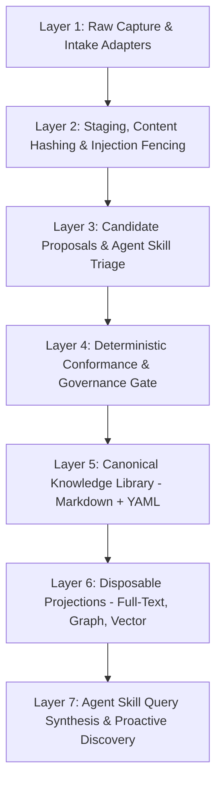

# Product Requirements Document (PRD): The Omniscient Trash Heap

> **Project Name:** The Omniscient Trash Heap  
> **Short Name:** Trash Heap  
> **CLI / Package:** `trashheap`  
> **Tagline:** *All the sources. All the wisdom. Some of the trash.*  
> **Brief Description:** A deterministic knowledge-ingestion system that turns messy sources into validated, traceable knowledge.  
> **Document Version:** `3.8.10`  
> **Status:** Authoritative Hardened Baseline (Backmapped & Aligned via Cognitive Reasoning & Adversarial Critic Pipeline)  
> **Theoretical Lineage & Inspirations:** Marjory the Trash Heap (Fraggle Rock oracle metaphor), Andrej Karpathy's LLM Wiki, Agent Skills (`agentskills.io` / `dot-agents.com`), Google OKF (v0.2), Graphify, GraphRAG, MemGraphRAG, Shuyi Wang Studio Paradigm  
> **Normative Source of Truth:** `specs/README.md`

---

## 1. Problem Statement & Threat Model Justification

Knowledge workers and software engineers accumulate high volumes of notes, research, literature, articles, and half-formed thoughts across disparate silos. Traditional personal wikis degrade into unmaintained file graveyards (*The Passive Graveyard*). Conversely, naive LLM implementations create catastrophic knowledge corruption by hallucinating connections, mutating ground truth, and blurring the line between raw capture and verified belief (*The Naive Autonomous Chaos*).

### 1.1 Multi-Source Ingestion & Threat Model Grounding
A personal wiki does not exist in an air-gapped vacuum. Users continuously ingest **untrusted external web articles, PDFs, papers, transcripts, and third-party codebases**. This realistic threat surface necessitates concrete defensive invariants:
- **Indirect Prompt Injection:** Malicious text or instructions hidden inside web clippings/PDFs attempting to hijack the LLM compilation step (e.g. attempting to delete canonical notes, exfiltrate private credentials, or write unauthorized facts).
- **Path Traversal & Insecure Slugs:** Malicious or malformed file names in external archives attempting relative path escapes (`../../`).
- **Circular Fact Contamination:** Synthesized AI summaries citing other unverified summaries, creating hallucination cascades.

### 1.2 Foundational Inspirations & The "Trash Heap" Metaphor
1. **The Omniscient Trash Heap Metaphor (Marjory the Trash Heap):**
   In Fraggle Rock, all characters turn to the Trash Heap when they need wisdom and guidance. The Trash Heap is omniscient precisely because she is composed of all the discarded scraps, fragments, and observations of the world, organically composted into pure truth. Similarly, *The Omniscient Trash Heap* allows users and agents to toss messy, unstructured artifacts onto the heap (intake), and through deterministic decomposition, two-pass claim extraction, and strict ontological gating, distills that raw heap into an authoritative, queryable oracle of knowledge.
   - **`trashheap-intake`:** Raw capture, hashing, and sandboxing (Layers 1–2).
   - **`trashheap-sort`:** Discovery, two-pass claim atomization, and staging triage (Layer 3).
   - **`trashheap-lint`:** Deterministic multi-layer conformance validation and invariant enforcement (Layer 4).
   - **`trashheap-canon`:** The canonical Markdown + YAML frontmatter knowledge library (Layer 5).
   - **`trashheap-query`:** Hybrid RRF retrieval and evidence-grounded synthesis (Layers 6–7).
2. **Andrej Karpathy's "LLM Wiki" Pattern & AI Coding Agent Rules:**
   - Filesystem-first, plain-text Markdown + YAML storage as the single source of truth.
   - Operating under the 4 agent behavioral axioms: *Think before coding*, *Simplicity first*, *Surgical changes*, and *Goal-driven verification*.
   - Models act as compilers and synthesizers of plain text rather than uncontrolled background database writers.
3. **Open Agent Skills Standard (`agentskills.io` / `dot-agents.com`):**
   - Interfacing AI agents through declarative, discoverable **Agent Skills** (`.agents/skills/trashheap/SKILL.md`).
   - Standardizing agent commands (`/ingest`, `/stage-lint`, `/lint`, `/validate`, `/query`, `/rebuild`) with formal schemas and execution guarantees.
   - Mandating that `SKILL.md` is deterministically generated from normative specifications (`specs/AGENT-SKILLS.md`), eliminating unmaintained ad-hoc placeholders.
4. **Google Open Knowledge Format (OKF v0.2):**
   - Standardized, Git-friendly typed Markdown packages for AI agent interoperability without chunking loss (`specs/OKF-INTEROP.md`).
5. **Shuyi Wang's Studio Paradigm:**
   - Transforming passive note hoarding (*The Warehouse*) into active cognitive synthesis (*The Studio*), delegating mechanical extraction to AI while keeping validation human-led.

### 1.3 Core Architectural Invariants
- **Zero Ground-Truth Corruption:** Markdown text + YAML frontmatter is the absolute, durable ground truth. All databases, vector embeddings, structural graphs, and indexes are disposable projections that can be deleted and recomputed deterministically in seconds.
- **Governed Staging Boundary:** Immutable raw intake (`staging/`) separates capture from belief. LLMs analyze, triage, and draft candidate proposals; promotion into the permanent corpus requires deterministic schema validation and explicit governance review.
- **Prompt Injection Defense & Path Sandboxing:** Strict token delimiters (`<untrusted_source>`) and absolute path sandboxing (`os.path.realpath`) prevent untrusted web/document inputs from escaping repository boundaries or executing arbitrary agent commands.
- **Non-Circular Provenance:** Factual claims require an unbroken provenance chain tracing back to raw source hashes (SHA-256).
- **Bounded Link Degree:** Enforcing an outbound link degree cap ($k \le 20$) to maintain graph query precision and prevent link-soup.
- **Declarative Registries as Single Source of Truth:** All valid object types, facets, relation types, taxonomies, and governance policies are loaded declaratively from `schemas/registry/`, never hardcoded.

---

## 2. System Architecture & Proving Slice Strategy

### Target Personas
- **Primary Persona:** Technical Knowledge Worker / Researcher ingesting mixed internal notes and external web sources.
- **System Persona:** Autonomous Coding/Reasoning Agents executing workflows via Agent Skills.

### 7-Layer Architecture Model (`ARCHITECTURE.md`)



### Proving Slice vs. Opt-in Extensions
To prevent over-engineering, requirements are partitioned into **Core Invariants** (proven by Plans 01–05 on ~20 real notes) and **Opt-in Projections** (additive, deferred extensions).

---

## 3. Data Contracts & Declarative Registries

### 3.1 Registry Baseline (`schemas/registry/`)
The system MUST dynamically load and validate against declarative registry files (never hardcoding object or relation types in code):
1. `object_registry.yaml`: Canonical source of truth for the 25 allowed Knowledge Object types (e.g. `Article`, `Document`, `Specification`, `Concept`, `Claim`, `Component`, `Incident`, `Sequence`), allowed scopes, and mandatory facets.
2. `relation_registry.yaml`: Canonical source of truth for the 30 typed ontology relations (e.g. `DEPENDS_ON`, `SUPERSEDES`, `DERIVED_FROM`, `DOCUMENTED_BY`), DAG acyclicity rules, and symmetry.
3. `taxonomy_registry.yaml`: Canonical forest of valid hierarchical taxonomy nodes and paths.
4. `epistemic_registry.yaml`: Canonical dimensions (`evidence`, `verification`, `authority`, `consensus`) and integer ranking weights for conflict resolution.
5. `governance_policy.yaml`: Review rules, lifecycle state machines, and actor roles.

### 3.2 Canonical Frontmatter Schema Example (`specs/SCHEMA.md` §6.1)
```yaml
---
# IDENTITY
id: ENG-FET-STREAM-0007
title: "Distributed Stream Ingestion Backpressure Control"
schema_version: "3.8.10"
aliases: ["Stream Backpressure Handling"]
keywords: [stream-engine, ingestion, backpressure, event-loop]

# ORGANIZATION & CLASSIFICATION
scope: engineering
taxonomy_path: "02. Event Streaming & Ingestion Pipelines"
taxonomy_id: TX-ENG-02
object_type: Feature
domain: data_pipelines

# FACETS
toolchain: [bazel, kafka]
prog_language: [cpp, rust]
architecture: [container, kubernetes]
lifecycle: ongoing
language: [en]

# EPISTEMOLOGY
evidence: observed
verification: peer_verified
authority: authoritative
consensus: accepted

# PROVENANCE
source_type: internal_document
source_refs: ["DV-ARCH-2026-089", "DV-RFC-2026-0012"]
author: duckburg-agent/vibe-coder
last_modified: "2026-08-15"
reviewer: human:donald_duck
last_verified: "2026-08-17"
next_review: "2027-02-17"
confidence: 0.9

# TEMPORAL & GOVERNANCE
validity:
  valid_from: "2026-06-01"
  valid_until: null
status: established

# ONTOLOGY
relations:
  - {type: INTRODUCED_IN, target: ENG-WPK-BUILD-0031}
  - {type: SATISFIES,     target: ENG-REQ-BUILD-0004}
  - {type: DOCUMENTED_BY, target: ENG-DOC-BUILD-0012}
---
```

---

## 4. Functional Requirements (Mapped to `specs/` & `plans/`)

### Track 1: Repository Foundation & Deterministic Core (`plans/01-02`, `specs/ARCHITECTURE.md`, `DATA_MODEL.md`, `ONTOLOGY.md`, `VALIDATION.md`, `specs/AGENT-SKILLS.md`)
- **FR-1 (Canonical Plain-Text Store):** Primary knowledge records MUST reside in Markdown files with structured YAML frontmatter per Karpathy's filesystem-first pattern.
- **FR-2 (Declarative Registry Engine):** Load object models, relations, and taxonomies dynamically from `schemas/registry/`.
- **FR-3 (Deterministic Slug & ID Generation):** Implement standardized, deterministic slugification (`ARCHITECTURE.md` §1.2).
- **FR-4 (Multi-Layer Linter & Error Code Contract):** Linter MUST validate syntax, registry conformance, DAG acyclicity, and epistemic consistency, outputting standardized error codes (`VALIDATION.md` §10.3).
- **FR-5 (Disposable Index Rebuild):** Recreate full-text search indexes and structural graph caches from scratch in a single deterministic, idempotent command (`tools/rebuild.sh` or Python CLI).
- **FR-6 (Hybrid Retrieval & RRF Ranking):** Implement hybrid retrieval using Reciprocal Rank Fusion (RRF) combining lexical BM25 and graph traversal (`RETRIEVAL.md`).
- **FR-7 (Agent Skills Standard Integration):** System MUST generate a fully conformant `.agents/skills/trashheap/SKILL.md` file adhering to the `agentskills.io` specification (`specs/AGENT-SKILLS.md`), defining `/ingest`, `/stage-lint`, `/lint`, `/validate`, `/query`, and `/rebuild` commands. Hand-written placeholder skill files are prohibited.
- **FR-8 (Atomic Rename & Reference Propagation):** When an entity or slug is renamed, the system MUST atomically propagate the update across all referencing documents and graph caches.
- **FR-9 (Dynamic Link Degree Cap):** The graph manager MUST enforce a maximum outbound link degree threshold ($k \le 20$) per note, flagging excessive links as `W015: HighDegreeWarning`.

### Track 2: Source Ingestion, Sandboxing & Safety (`plans/03`, `specs/INGEST*.md`, `UNIVERSAL-SOURCE-EXTENSION.md`)
- **FR-10 (Universal Intake Adapters):** Ingest raw inputs (web URLs, PDF, markdown notes, transcripts) into immutable raw representations.
- **FR-11 (Content Hash Deduplication):** Calculate SHA-256 content hashes on ingestion to prevent duplicate staging records.
- **FR-12 (Staging Isolation & Security Fence):** Staged records MUST be stored in `staging/` and wrapped with strict untrusted data fences (`<untrusted_source>`), remaining completely invisible to production queries until promoted.
- **FR-13 (Path Traversal Protection):** All file I/O operations MUST normalize paths (`os.path.realpath`) and reject any attempt to read/write outside the designated repository root with an `AccessDeniedError`.

### Track 3: Proposal, Review & Governed Promotion (`plans/04`, `specs/REVIEW-PROMOTION.md`, `EPISTEMOLOGY.md`)
- **FR-14 (LLM Triage & Candidate Extraction):** Analyze staged artifacts to propose `object_type`, taxonomy, epistemic metadata, and cross-references as structured candidate JSON diffs.
- **FR-15 (Deterministic Promotion Gate):** Promote candidate proposals to canonical `notes/*.md` only after passing linter validation and explicit governance review.
- **FR-16 (Atomic Write Operations):** All file writes to the canonical corpus MUST use atomic file replacement (`.tmp` + `os.replace`) to guarantee zero corruption on interruption.
- **FR-17 (Non-Circular Provenance Enforcement):** Fact synthesis MUST enforce an explicit provenance trail, rejecting synthesized claims that cite other synthesized notes without a primary raw intake hash link.

### Track 4: Active Intelligence, Interoperability & Projections (`specs/DISCOVERY.md`, `GRAPH-INTELLIGENCE.md`, `OKF-INTEROP.md`, `plans/05`, `61`, `90-93`)
- **FR-18 (Evidence-Based Query Synthesis):** CLI and Agent Skill query command (`trashheap query "prompt"` / `/query`) synthesizes multi-document answers with explicit note citations (`[[note-slug]]`).
- **FR-19 (Proactive Link Discovery & Epistemic Conflict Detection):** Periodically scan corpus clusters to detect missing relational links and flag contradictory claims across notes.
- **FR-20 (Google OKF Interoperability — Opt-in):** Export and import knowledge bundles matching Google Open Knowledge Format v0.2 without loss of semantic fidelity (`specs/OKF-INTEROP.md`).
- **FR-21 (Graphify & Structural Graph Projections — Opt-in):** Support local AST-based referential integrity verification and structural relationship traversal (`specs/STRUCTURAL-GRAPH.md`).

---

## 5. Non-Functional Requirements & Performance Targets

- **NFR-1 (Runtime Baseline):** Python `>=3.11`, Pydantic v2, PyYAML, `uv` package management, `pytest`, and `ruff` linting/formatting per [`PREFERRED-TECH-STACK.md`](file:///home/daniel6651/llm-wiki-oe/input-artifacts/PREFERRED-TECH-STACK.md).
- **NFR-2 (Performance Budgets & Empirical Targets):**
  - Schema linting and validation of 1,000 notes MUST satisfy the design budget of $< 2.0$ seconds (single-pass I/O).
  - Full disposable index rebuild of 1,000 notes MUST complete in $< 5.0$ seconds.
  - Hybrid RRF retrieval query latency target $< 100$ ms for 10,000 notes.
  - *Measurement Contract:* In accordance with **SCALE-001**, all performance figures are design budgets to be empirically benchmarked during Phase 05 (`plans/05-CONNECTORS-OPERATIONS-CI.md`) rather than unverified capacity assumptions.
- **NFR-3 (Crash Safety & Invariance):** Total immunity to file truncation on process interrupt via atomic writes.
- **NFR-4 (Zero External Lock-in):** Core operations execute locally with zero mandatory cloud service or proprietary database dependencies.
- **NFR-5 (Agent Standard Conformance):** Emitted Agent Skill definitions MUST validate against `agentskills.io` JSON schemas with 100% compliance.
- **NFR-6 (Indirect Prompt Injection Defense):** Ingestion system prompts MUST sandbox raw sources and explicitly disable command execution based on untrusted text contents.

---

## 6. Risks, Failure Modes & Mitigations Matrix

| Failure Mode / Risk | Severity | Criticality Score | Root Cause | Technical Mitigation (`specs/`) |
| :--- | :--- | :--- | :--- | :--- |
| **Model Hallucination / Silent Drift** | High | 90 | LLM inventing facts or mutating definitions during write passes. | Governed proposal workflow (`REVIEW-PROMOTION.md`). LLM only outputs candidate proposals; deterministic linter + review gate. |
| **Prompt Injection via Raw Web Ingest** | High | 80 | Malicious prompt instructions embedded in untrusted web/pdf sources. | Immutable `<untrusted_source>` delimiters, tool call fencing, and disabled command execution during ingestion (`FR-12`, `NFR-6`). |
| **Path Traversal / Arbitrary Overwrite** | High | 70 | Unvalidated relative paths (`../../`) in generated slugs or links. | Strict `os.path.realpath` prefix validation enforcing repository boundary locks (`FR-13`). |
| **Circular Fact Seeding (Error Compounding)** | Medium | 60 | Synthesized notes citing other synthesized notes without raw grounding. | Provenance validation requiring direct links back to raw source hashes (`FR-17`, `EPISTEMOLOGY.md`). |
| **Review Fatigue (Abandoned Queue)** | High | 56 | Large volume of intake artifacts overwhelming manual review. | Automated batch triage and metadata drafting in `/stage-lint` (`INGEST-STAGING.md`). |
| **Link-Soup & Precision Degradation** | Medium | 50 | Unbounded automated cross-linking creating dense, noisy graphs. | Dynamic link degree cap ($k \le 20$) and cosine similarity thresholding (`FR-9`). |
| **Agent Skill Drift / Broken Tooling** | Medium | 48 | Hand-editing `.agents/skills/SKILL.md` out of sync with actual CLI commands. | Automated deterministic code-generation of `SKILL.md` from `specs/AGENT-SKILLS.md` and registries (`FR-7`, `E050`). |
| **Index / Source Desynchronization** | Medium | 35 | Edits directly in text editor bypassing internal indexes. | Indexes are 100% disposable projections. Checksum-based stale detection and idempotent rebuild (`ARCHITECTURE.md`). |

---

## 7. Stated Non-Goals

- **Non-Goal 1:** Multi-tenant SaaS, cloud hosting infrastructure, or user login systems.
- **Non-Goal 2:** Heavy browser web UI framework (CLI, terminal, IDE, and Agent Skill interfaces are primary).
- **Non-Goal 3:** Mandatory proprietary vector or graph databases for base operation.
- **Non-Goal 4:** Unattended autonomous bulk mutations of canonical knowledge without review gates.

---

## 8. Acceptance Criteria & Proving Slice Roadmap Mapping

- [ ] **AC-1 (Registry & Linter Foundation — Plan 01-02):** `tools/check.sh` runs Pydantic v2 models against `schemas/registry/*.yaml` and validates 100% of canonical notes with zero unhandled exceptions.
- [ ] **AC-2 (Agent Skill Conformance — Plan 02):** Running `trashheap generate-skills` emits `.agents/skills/trashheap/SKILL.md` matching `agentskills.io` specification with zero validation errors.
- [ ] **AC-3 (Atomic Rename & Graph Invariant — Plan 02):** Renaming a note updates all backlinks and `graph.json` entries atomically without orphan references.
- [ ] **AC-4 (Disposable Rebuild Invariant — Plan 02/05):** Deleting derived cache directories and running `rebuild` completely recreates identical search and graph query projections.
- [ ] **AC-5 (Safe Staging & Web Ingest Injection Fencing — Plan 03):** Staged inputs from untrusted web/pdf sources in `staging/` are deduplicated via SHA-256, fenced with `<untrusted_source>` delimiters, and isolated from production retrieval passes.
- [ ] **AC-6 (Path Sandboxing Invariant — Plan 03):** Any file read/write payload targeting paths outside repository root is rejected with `AccessDeniedError`.
- [ ] **AC-7 (Governed Promotion & Atomic Safety — Plan 04):** Promoting a candidate diff validates against linter rules and atomically writes the target note without file corruption.
- [ ] **AC-8 (Evidence Synthesis & Citation — Plan 05):** Running `trashheap query` produces an answer where all citation slugs resolve to valid canonical notes.
- [ ] **AC-9 (OKF Interoperability — Plan 61):** Exporting a note subset generates conformant OKF v0.2 bundles verifiable against `external-specs/okf/`.
- [ ] **AC-10 (Clean CI Checkout):** Complete test suite (`pytest`) runs in GitHub Actions from a clean checkout and achieves 100% pass rate.
