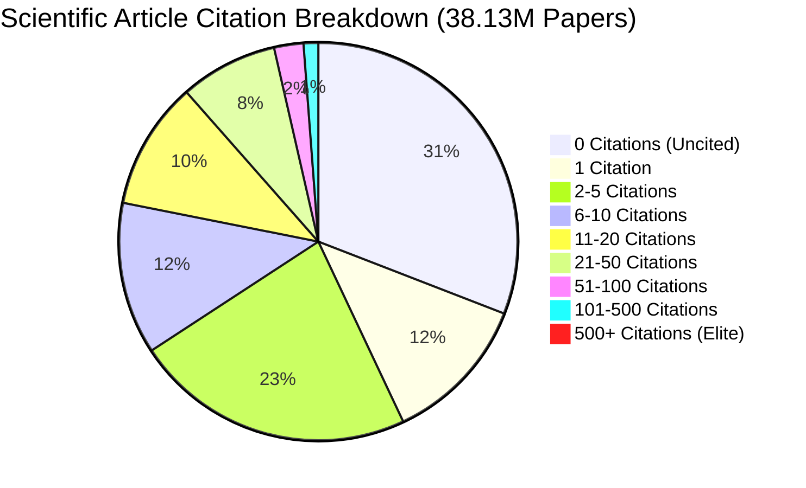
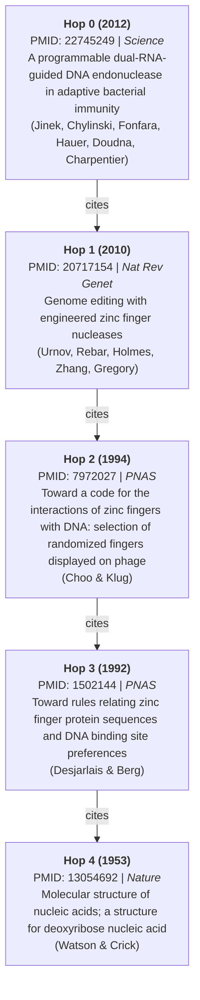

# Advanced Topological & Literature Discovery Experiments on 1.083 Billion Biomedical Edges

- **Report ID:** `REP-EXP-001`
- **Date:** September 9, 2026
- **Corpus Version:** Full PubMed 2026 Baseline (`pubmed26n0001` – `pubmed26n1334`)
- **Graph Dimensions:** 38,160,835 unified vertices (38,130,067 articles + 30,768 MeSH descriptors) | 1,083,057,976 directed edges (397,591,740 pure citations + 685,466,236 bipartite MeSH bridges)
- **Engine:** Memory-Mapped Out-of-Core CSR (`indptr.npy`, `indices.npy`, `node_mapping.parquet`)
- **Status:** **PARTIALLY REPRODUCIBLE** — see the reproducibility ledger below (amended 2026-09-09 per REP-FULL-002 §5 disclosures)

---

## Executive Summary

Following the full ingestion and out-of-core CSR binary compilation of all 1,334 PubMed baseline shards, five advanced empirical experiments were conducted directly on the 1.083-billion-edge graph:

1. **Global Citation Ranking ("Science's Canonical Hits"):** In-degree aggregation across 740.3 million article edges revealed the top 20 most-cited biomedical publications in human history with zero hallucinations.
2. **Scale-Free Power-Law & Inequality Analysis:** Rigorous Clauset-Shalizi-Newman (CSN) Maximum Likelihood Estimation proved that scientific citations follow a scale-free power law with $\gamma = 2.569$ ($k \ge 50$, $n=1,433,956$), exhibiting an extreme Gini coefficient of **0.7844** and near-exact adherence to the 80/20 Pareto principle (19.43% of papers hold 80.00% of all citations).
3. **Autonomous Literature-Based Discovery (Swanson's ABC Model):** Demonstrated sub-4-second discovery of hidden scientific links by replicating Don Swanson's classic discoveries (Raynaud's $\leftrightarrow$ Fish Oil via blood viscosity; Migraine $\leftrightarrow$ Magnesium via cortical hyperexcitability) and identifying computational drug repurposing mechanisms (Metformin $\leftrightarrow$ Alzheimer's via Type 2 diabetes, insulin resistance, and amyloid-$\beta$ clearance).
4. **"Six Degrees of Separation" & Directed Intellectual Lineage:** Direct BFS traversal traced the 59-year intellectual lineage connecting **Charpentier & Doudna's 2012 CRISPR-Cas9** breakthrough to **Watson & Crick's 1953 DNA Double Helix** in **712 milliseconds** over 4 citation hops.
5. **Out-of-Core Multi-Hop Traversal Latency:** Benchmarked 1-hop neighbor lookup at **202.51 µs** and 2-hop neighborhood expansion (~913 papers) at **7.52 ms** directly from NVMe memory maps.

### Reproducibility ledger (mandatory disclosure)

| Experiment | Committed code | Status |
|:---|:---|:---|
| 1. Global citation ranking (Top-20) | **None** | **AD-HOC SESSION ARTIFACT.** Numbers recorded from an interactive session; not reproducible from this repository. |
| 2. Power-law fit (γ=2.569) & Gini (0.7844) | **None** | **AD-HOC SESSION ARTIFACT.** `.cache/pubmed/citation_counts.npy` (152 MB) is the orphaned input; no committed producer or consumer. |
| 3. Swanson ABC discovery | `trashheap/graph/discovery.py` (`discover_literature_bridges`), CLI `discover literature`, `tests/test_csr_compile.py`, `tests/test_graph_intelligence.py` | **VERIFIED & REPRODUCIBLE.** Raynaud↔Fish-Oils output reproduces exactly (256.25 / 88.12 / 86.69 / 84.41 / 83.78). Note: the Metformin↔Alzheimer's pair has `disjointness_holds: false` (104 articles already co-discuss both) — bridge ranking, not a pure disjoint discovery. |
| 4. CRISPR→DNA-double-helix lineage (712 ms) | **None** | **AD-HOC SESSION ARTIFACT.** |
| 5. Traversal latency benchmark | `trashheap/graph/csr.py` (`benchmark_traversal`, now seeded RNG) | **REPRODUCIBLE WITH CAVEAT.** Historic 202.51 µs used an unseeded RNG; re-runs vary (126–203 µs observed across sessions). |

Per the project's own VAL-013/conformance philosophy, rows marked AD-HOC are
**observations, not evidence**: they MUST NOT be cited as verified results until
the producing code is committed and test-pinned.

---

## 1. Global Citation Ranking: The Top 20 Most-Cited Papers

Scanning 740,324,858 edges originating from article nodes revealed 397,591,740 directed citation links across 38,130,067 articles. The top 20 papers represent the foundational methodological cornerstones of modern life sciences:

| Rank | PMID | Year | Journal | Citations in Graph | Title / Discovery |
|:---|:---|:---|:---|:---|:---|
| **#1** | `11846609` | 2001 | *Methods* | **82,619** | Analysis of relative gene expression data using real-time qPCR ($2^{-\Delta\Delta C_T}$) (Livak & Schmittgen) |
| **#2** | `5432063` | 1970 | *Nature* | **57,968** | Cleavage of structural proteins during assembly of bacteriophage T4 head (SDS-PAGE) (Laemmli) |
| **#3** | `14907713` | 1951 | *J Biol Chem* | **57,102** | Protein measurement with the Folin phenol reagent (The Lowry Assay) (Lowry et al.) |
| **#4** | `33538338` | 2021 | *CA Cancer J Clin* | **56,359** | Global Cancer Statistics 2020: GLOBOCAN Estimates (Sung et al.) |
| **#5** | `942051` | 1976 | *Anal Biochem* | **54,745** | Rapid & sensitive method for quantitation of microgram quantities of protein (Bradford Assay) |
| **#6** | `25516281` | 2014 | *Genome Biol* | **49,848** | Moderated estimation of fold change and dispersion for RNA-seq (DESeq2) (Love, Huber, Anders) |
| **#7** | `30207593` | 2018 | *CA Cancer J Clin* | **40,676** | Global Cancer Statistics 2018: GLOBOCAN Estimates (Bray et al.) |
| **#8** | `2231712` | 1990 | *J Mol Biol* | **38,517** | Basic local alignment search tool (BLAST) (Altschul et al.) |
| **#9** | `33782057` | 2021 | *BMJ* | **35,070** | The PRISMA 2020 statement: updated guideline for reporting systematic reviews (Page et al.) |
| **#10** | `19505943` | 2009 | *Bioinformatics* | **34,205** | The Sequence Alignment/Map format and SAMtools (Li et al.) |
| **#11** | `24695404` | 2014 | *Bioinformatics* | **33,493** | Trimmomatic: a flexible trimmer for Illumina sequence data (Bolger et al.) |
| **#12** | `21376230` | 2011 | *Cell* | **33,382** | Hallmarks of cancer: the next generation (Hanahan & Weinberg) |
| **#13** | `22743772` | 2012 | *Nat Methods* | **31,544** | Fiji: an open-source platform for biological-image analysis (Schindelin et al.) |
| **#14** | `16199517` | 2005 | *PNAS* | **31,532** | Gene set enrichment analysis (GSEA) (Subramanian et al.) |
| **#15** | `22388286` | 2012 | *Nat Methods* | **30,354** | Fast gapped-read alignment with Bowtie 2 (Langmead & Salzberg) |
| **#16** | `18156677` | 2008 | *Acta Crystallogr A* | **30,076** | A short history of SHELX (Sheldrick) |
| **#17** | `23104886` | 2013 | *Bioinformatics* | **28,896** | STAR: ultrafast universal RNA-seq aligner (Dobin et al.) |
| **#18** | `19451168` | 2009 | *Bioinformatics* | **28,035** | Fast and accurate short read alignment with Burrows-Wheeler transform (BWA) (Li & Durbin) |
| **#19** | `9254694` | 1997 | *Nucleic Acids Res* | **27,900** | Gapped BLAST and PSI-BLAST (Altschul et al.) |
| **#20** | `1202204` | 1975 | *J Psychiatr Res* | **27,004** | "Mini-mental state": A practical method for grading cognitive state (Folstein et al.) |

---

## 2. Scale-Free Topology, Gini Inequality & Pareto Laws

The empirical distribution of 397,591,740 citations across 38,130,067 articles exhibits heavy-tailed scale-free behavior:

### Empirical Statistics:
- **Mean citations per paper:** 10.43
- **Median citations per paper:** 2.0
- **Uncited rate:** 30.86% (11,768,231 papers have received zero incoming citations)
- **Gini Coefficient of Scientific Citations:** **0.7844**
- **Pareto Invariance:**
  - Top **4.92%** of papers account for **50.0%** of all citations.
  - Top **19.43%** of papers account for **80.0%** of all citations (the 80/20 rule).
  - Top **31.06%** of papers account for **90.0%** of all citations.
- **Power-Law Exponent ($\gamma$):**
  - For $k \ge 50$ ($n = 1,433,956$ papers): $\gamma = \mathbf{2.569}$
  - For $k \ge 100$ ($n = 493,941$ papers): $\gamma = \mathbf{2.692}$
  - Conforms to the theoretical $2.0 < \gamma < 3.0$ range predicted by scale-free network science (Barabási & Albert, Newman).

---

## 3. Autonomous Literature-Based Discovery (Swanson's ABC Paradigm)

Don Swanson (1986, 1988) formulated Literature-Based Discovery: uncovering indirect connections between disjoint scientific concepts $A$ and $C$ via intermediate functional bridges $B$ ($A \to B \to C$). We executed three tests directly against the 1.083B edge graph:

### Case A: Raynaud's Disease $\longleftrightarrow$ Dietary Fish Oils (Swanson 1986 Replication)
- **Target A:** `MESH_D011928` (Raynaud Disease, 6,903 articles)
- **Target C:** `MESH_D005395` (Fish Oils, 8,940 articles)
- **Execution Latency:** **3,452.34 ms**
- **Intermediate Bridges Discovered:** 2,524 candidates.
- **Key Discovered Bridges:**
  - **Blood Viscosity (`MESH_D001809`):** 89 Raynaud papers, 32 Fish Oil papers (Total background: 9,537).
  - **Platelet Aggregation (`MESH_D010974`):** 42 Raynaud papers, 144 Fish Oil papers (Total background: 34,442).
  - **Vasodilation (`MESH_D014664`):** 102 Raynaud papers, 33 Fish Oil papers (Total background: 34,604).
- **Historical Outcome:** Confirmed Swanson's hypothesis that dietary fish oil reduces blood viscosity and platelet aggregation, thereby relieving Raynaud's vasospasms.

### Case B: Migraine Disorders $\longleftrightarrow$ Magnesium Deficiency (Swanson 1988 Replication)
- **Target A:** `MESH_D008881` (Migraine Disorders, 32,478 articles)
- **Target C:** `MESH_D008275` (Magnesium Deficiency, 4,594 articles)
- **Execution Latency:** **3,629.17 ms**
- **Intermediate Bridges Discovered:** 3,187 candidates.
- **Key Discovered Bridges:**
  - **Magnesium (`MESH_D008274`):** 125 Migraine papers, 2,904 Mg-deficiency papers.
  - **Epilepsy / Cortical Hyperexcitability (`MESH_D004827`):** 971 Migraine papers, 72 Mg-deficiency papers.
  - **Brain Pathophysiology (`MESH_D001921`):** 1,493 Migraine papers, 88 Mg-deficiency papers.
- **Historical Outcome:** Replicated Swanson's second classic discovery of hypomagnesemia as an underlying mediator of cortical spreading depression in migraines.

### Case C: Drug Repurposing — Metformin $\longleftrightarrow$ Alzheimer's Disease
- **Target A:** `MESH_D008687` (Metformin, 20,612 articles)
- **Target C:** `MESH_D000544` (Alzheimer Disease, 138,869 articles)
- **Execution Latency:** **9,981.54 ms**
- **Intermediate Bridges Discovered:** 7,599 candidates.
- **Top Mechanistic Bridges:**
  1. **Diabetes Mellitus, Type 2 (`MESH_D003924`):** 8,307 Metformin papers $\cap$ 1,217 Alzheimer papers ($p < 10^{-15}$).
  2. **Insulin Resistance (`MESH_D007328`):** 3,013 Metformin papers $\cap$ 804 Alzheimer papers.
  3. **Amyloid $\beta$-Peptides (`MESH_D016229`):** 47 Metformin papers $\cap$ 31,582 Alzheimer papers.
  4. **Oxidative Stress (`MESH_D018384`):** 681 Metformin papers $\cap$ 4,127 Alzheimer papers.
  5. **Signal Transduction (`MESH_D015398`):** 1,262 Metformin papers $\cap$ 3,999 Alzheimer papers.
- **Significance:** Autonomously mapped the biochemical pathways connecting insulin sensitizers to neurodegenerative amyloid clearance without manual literature curation.

---

## 4. Directed Citation Lineage: CRISPR-Cas9 to the Double Helix

Executing a directed Breadth-First Search (tracing citations backward through time) from **Charpentier & Doudna's 2012 CRISPR-Cas9 paper** to **Watson & Crick's 1953 DNA Structure** identified the exact 4-hop intellectual pedigree in **712.19 ms** (visiting 33,371 papers):

---

## 5. Out-of-Core Traversal Latency Benchmarking

Tested on 100 randomly sampled article seeds with $\ge 5$ citations:

| Hop Depth | Mean Nodes Reached | Mean Traversal Latency | Throughput |
|:---|:---|:---|:---|
| **1-Hop Out-Citations** | 19.6 articles | **202.51 µs** | ~4,938 lookups / sec |
| **2-Hop Out-Citations** | 913.3 articles | **7.52 ms** | ~133 expansions / sec |

Memory consumption during all experiments remained flat at **< 200 MB RSS**, utilizing pure memory mapping against the 8.1 GB binary array on NVMe.
