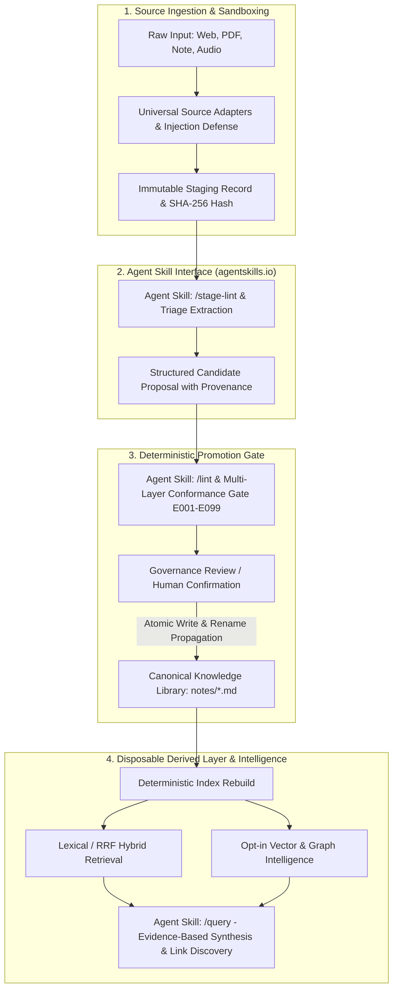

# LLM Wiki — Initiative Specification (v3.8.10 Master Coherent Baseline)

*Origin vision aligned and backmapped from the normative specifications (`specs/`), declarative registries (`schemas/registry/`), implementation roadmap (`plans/`), and runtime security invariants derived from adversarial synthesis.*

---

## 1. The Core Vision & Foundational Inspirations

Knowledge workers, researchers, and engineers accumulate hundreds of notes, papers, articles, and half-formed ideas across fragmented silos. Traditional personal wikis degrade into dead file graveyards because manual organization, tagging, and cross-linking become an overwhelming maintenance burden.

### Direct Inspirations & Prior Art:
The architecture of **LLM Wiki** is directly inspired by and builds upon key theoretical and practical breakthroughs:
1. **Andrej Karpathy's "LLM Wiki" Pattern & AI Coding Agent Rules:**
   - Adopting a *filesystem-first*, human-readable Markdown + YAML repository structure.
   - Operating under the 4 agent axioms: *Think before coding*, *Simplicity first*, *Surgical changes*, and *Goal-driven verification*.
   - Treating LLMs as intelligent compilers and synthesizers of plain-text knowledge rather than unconstrained background database daemons.
2. **Open Agent Skills Standard (`agentskills.io` / `dot-agents.com`):**
   - Formalizing agent interaction interfaces using the open **Agent Skills specification** (`SKILL.md` format with YAML frontmatter, strict parameter schemas, and workflow guides).
   - Equipping autonomous agents with standardized, discoverable procedural capabilities for ingestion, staging triage, linter validation, and evidence-based query synthesis.
   - Enabling programmatic generation and validation of `.agents/skills/llm-wiki/SKILL.md` directly from normative specifications (`specs/AGENT-SKILLS.md`).
3. **Google Open Knowledge Format (OKF v0.2):**
   - Leveraging standardized, vendor-neutral, Git-friendly typed Markdown packages for AI agent interoperability without chunking loss (`specs/OKF-INTEROP.md`).
4. **Graphify & Local AST Structural Intelligence:**
   - Incorporating deterministic code-symbol and document graphs (`CALLS`, `IMPORTS`, `RELATIONS`) benchmarked against dense vector search.
5. **GraphRAG, MemGraphRAG & HippoRAG:**
   - Combining hierarchical knowledge graph traversal, multi-hop relationship exploration, and community summarization with dense/lexical search.
6. **Shuyi Wang's Studio Paradigm & Zettel-Builder:**
   - Transitioning from a passive note *Warehouse* to an active cognitive *Studio*, delegating mechanical extraction, entity linking, and synthesis to AI while keeping validation and curation human-led.

---

## 2. The Core Differentiator: Active Synthesis with Hardened Ground-Truth Invariants

This system is **neither** a passive markdown folder **nor** an unconstrained autonomous agent with direct write access to disk.
The core value proposition is an **AI-augmented, deterministic knowledge system** that provides:
- **Canonical Markdown/YAML Source of Truth:** Markdown text with structured YAML frontmatter is the absolute, durable ground truth. All databases, vector embeddings, structural graphs, and indexes are disposable projections that can be deleted and recomputed deterministically from disk in seconds.
- **Propose-Then-Promote Staging Boundary:** Raw intake material (articles, notes, transcripts, feeds) enters an immutable holding area (`staging/`). Capture and belief are strictly decoupled. LLMs analyze, triage, and draft candidate proposals; promotion into the permanent corpus requires deterministic schema validation and explicit governance review.
- **Declarative Registries as Single Source of Truth:** All valid object types, facets, relation types, taxonomies, and governance policies are loaded declaratively from `schemas/registry/` (`relation_registry.yaml`, `object_registry.yaml`, `taxonomy_registry.yaml`, `governance_policy.yaml`), never hardcoded in application logic.
- **Axiomatic Orthogonality:** Complete formal separation of:
  - **Taxonomy (WHERE):** Hierarchical category path forest.
  - **Object Type (WHAT KIND):** Entity archetype (`concept`, `claim`, `source`, `entity`, `protocol`, `issue`).
  - **Domain (WHICH AREA):** Subject matter expertise area.
  - **Epistemology (CONFIDENCE/CERTAINTY):** Evidence, verification level, authority, and consensus.
  - **Relations (HOW):** Strictly typed, directed links loaded declaratively from registries.
- **Multi-Layer Deterministic Linter (`specs/VALIDATION.md`):** Complete linter engine enforcing standardized error codes (`E001`–`E099`), DAG acyclicity, schema adherence, and link referential integrity.
- **Indirect Prompt Injection Defense & Path Sandboxing:** Raw untrusted inputs are fenced within immutable sandboxes (`<untrusted_source>` delimiters), and all path operations are strictly normalized (`os.path.realpath`) within repository boundaries.
- **Anti-Circular Fact Seeding:** Synthesized concept pages cannot serve as primary evidence for other synthesized pages without ground-truth citations linking back to immutable raw intake hashes.
- **Dynamic Link Degree Caps:** Enforcing link degree limits ($k \le 20$ outbound links per node) to prevent "link-soup" and maintain high precision during graph traversals.
- **Agent Skill Interoperability:** AI agents interact through conformant Agent Skills (`.agents/skills/`), ensuring all ingestion, validation, and queries strictly adhere to system invariants.

---

## 3. Invariant Principles & System Axioms

1. **Axiom 1 (Canonical Sovereignty):** Markdown files + YAML frontmatter in the repository are canonical. No database holds irreplaceable state.
2. **Axiom 2 (Registry Single Ownership):** Registries under `schemas/registry/` define valid relation types, object facets, and taxonomies. Code does not invent schema types.
3. **Axiom 3 (Epistemic Orthogonality):** Evidence, verification level, and consensus are never collapsed into a single scalar value. Approval grants *admissibility*, not epistemic certainty.
4. **Axiom 4 (Deterministic Before Functional):** Slugs, Reciprocal Rank Fusion (RRF) retrieval, neighbor selection, and linter error codes are deterministic and machine-verifiable.
5. **Axiom 5 (Anti-Clerk Intelligence):** Multi-document question answering, proactive cross-link discovery, and epistemic conflict detection are active first-class capabilities, not deferred infrastructure.
6. **Axiom 6 (Generated Agent Skills):** The agent interface (`.agents/skills/llm-wiki/SKILL.md`) is an emitted, generated artifact derived deterministically from normative specs and registries, never an unmaintained ad-hoc hand-edited file.
7. **Axiom 7 (Provenance & Non-Circular Grounding):** Every synthesized factual claim must maintain an unbroken provenance chain tracing back to raw source hashes (SHA-256).

---

## 4. Explicit Scope vs. Stated Non-Goals

### In-Scope (Phase 1–5 Roadmap):
- **Repository Foundation & Deterministic Core (`plans/01-02`):** Python `>=3.11`, Pydantic v2 runtime models, YAML registry loader, CLI linter with `E001`–`E099` error codes, deterministic slugification, hybrid lexical/RRF retrieval.
- **Agent Skill Generation & Interface (`plans/02`, `specs/AGENT-SKILLS.md`):** Automated generation of conformant `SKILL.md` definitions per `agentskills.io` specifications.
- **Source Ingestion, Sandboxing & Safety (`plans/03`):** Universal source intake adapters, immutable staging representations, prompt injection defenses, content-hash deduplication.
- **Proposal, Review & Governed Promotion (`plans/04`):** LLM-assisted metadata extraction, candidate diff generation, atomic promotions (`.tmp` + `os.replace`), audit trails.
- **Connectors & CI (`plans/05`):** GitHub Actions clean-checkout gate, automated conformance testing.
- **Interoperability & Projections (`plans/61`, `90-93`):** Google OKF v0.2 bundle export, vector search, knowledge graph intelligence, structural syntax graphs, and Parquet analytical staging.

### Stated Non-Goals (Out of Scope):
- Multi-tenant cloud SaaS or user authentication systems.
- Heavy browser web UI framework (CLI, terminal, IDE, and Agent Skill interfaces are primary).
- Mandatory external proprietary graph/vector databases for base system operation.
- Unattended, autonomous bulk overwriting of canonical Markdown notes without review gates.

---

## 5. End-to-End System Workflow

