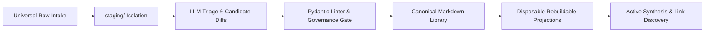

# LLM Wiki — Opportunity Brief (v3.8.10 Grounded Baseline)

> **Document Type**: Review Input Artifact; not a normative owner
> **Status**: Refined via Second-Order Analysis, Resource Optimization & Anti-Clerk Diagnostics
> **Scope**: Value Proposition, Theoretical Lineage & Phased Opportunity

---

## 1. The Core Value Proposition: Active Synthesis with Zero Ground-Truth Corruption

LLM Wiki transforms personal and technical knowledge bases from passive note repositories (*The Warehouse*) into active, compounding cognitive synthesis engines (*The Studio*), grounded in five foundational research paradigms:

1. **Andrej Karpathy's LLM-Wiki Pattern:** Plain-text Markdown + YAML filesystem storage, operating under surgical, test-driven AI agent rules.
2. **Google Open Knowledge Format (OKF v0.2):** Git-friendly, vendor-neutral typed Markdown packaging for lossless agent interoperability.
3. **Graphify & Structural AST Intelligence:** Local deterministic code-symbol and document relationship graphs (`CALLS`, `IMPORTS`, `RELATIONS`).
4. **GraphRAG & MemGraphRAG:** Multi-hop graph traversal and Reciprocal Rank Fusion (RRF) hybrid retrieval combining lexical and semantic search.
5. **Shuyi Wang's Studio Paradigm:** Human-curated, AI-compiled knowledge pipelines where LLMs propose and deterministic compilers verify.

---

## 2. The Structural Solution Architecture

- **Isolated Intake (`staging/`):** Capture everything with zero friction; raw files are content-hashed and quarantined from production queries.
- **Governed Promotion Gate:** Deterministic schema validation against declarative registries (`schemas/registry/`) ensures zero invalid states enter the permanent library.
- **Disposable Projections:** Search indexes and graph caches are completely ephemeral, guaranteeing zero database lock-in.
- **First-Class Synthesis:** Evidence-based multi-document synthesis with mandatory citations (`[[note-slug]]`) ensures actionable insights without model hallucination.

---

## 3. Second-Order Opportunity & Risk Management

- **Mitigating Review Fatigue:** Staging triage incorporates automated metadata extraction and batch validation, allowing one-command review passes.
- **Preventing Premature Over-Engineering:** Strict phased execution (Plans 01–05 core, Plans 90–93 opt-in) ensures baseline usability is validated before complex graph/vector extensions are activated.
- **Git-Native Portability:** By rejecting proprietary database backends, every wiki is fully portable, inspectable in standard text editors, and safely synchronized across machines via Git.
