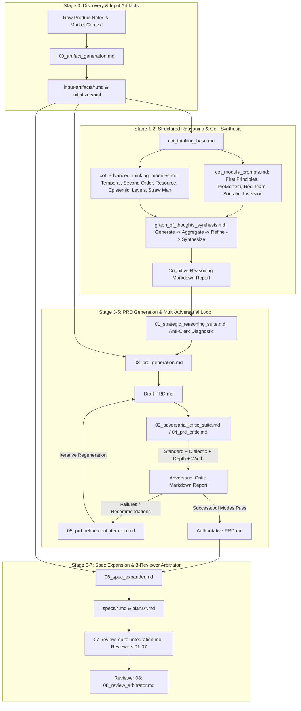

# End-to-End Cognitive Development & PRD Pipeline

This directory contains a proposed end-to-end prompt suite for **LLM Wiki**. It integrates raw discovery artifact generation, structured reasoning, PRD generation, adversarial criticism, specification expansion, and reviewer arbitration. It is a prompt architecture and set of templates, not an implemented orchestration system.

**Shared contract:** Every prompt MUST read and follow [`00_PIPELINE_CONTRACT.md`](./00_PIPELINE_CONTRACT.md). That file owns evidence status, provenance, trust boundaries, artifact handoffs, traceability, iteration semantics and implementation-status honesty.

**Declarative manifest:** [`PIPELINE_MANIFEST.yaml`](./PIPELINE_MANIFEST.yaml)
is the canonical stage/order/variant/handoff projection. It describes intended
execution; it does not execute prompts or write files.

Human-facing outputs use **GitHub-flavored Markdown**. Stage metadata/manifests
may use YAML blocks as defined by the shared contract; this does not make the
pipeline executable or imply that generated files are automatically written.

---

## 🏗 Full Lifecycle Architecture & Execution Flow

The diagram is explanatory only. For stage IDs, canonical prompts, variants and
handoff fields, use `PIPELINE_MANIFEST.yaml`.

---

## 📖 How to Use the Pipeline (Step-by-Step Guide)

The templates describe two modes: **Modular Phased Mode** (recommended for deep architecture work) and **Fast Single-Call Mode**. No orchestration command is included; inputs, outputs and handoffs must be supplied by the caller according to the shared contract.

### Mode A: Modular Phased Execution (Recommended)

1. **Step 0: Scaffold Discovery Artifacts**
   - Use `00_artifact_generation.md` with raw product ideas to emit `input-artifacts/` (`initiative.md`, `problem_statement.md`, `opportunity_brief.md`, `market_analysis.md`, `user_research_notes.md`, and `initiative.yaml`).
2. **Step 1: Evaluate the initiative**
   - Execute `01_initiative_review.md`.
3. **Step 2: Run structured reasoning & GoT synthesis**
   - Execute `01_strategic_reasoning_suite.md` (supplemented by the reusable reasoning modules). The output is a structured, evidence-bound report; hidden chain-of-thought is not a required deliverable.
   - Run `graph_of_thoughts_synthesis.md` to merge parallel thought threads into a consolidated Markdown report.
4. **Step 3: Refine the initiative**
   - Execute `02_initiative_refinement.md` while preserving unresolved unknowns.
5. **Step 4: Generate Draft PRD**
   - Execute `03_prd_generation.md` using the enriched initiative, discovery artifacts and reasoning report.
6. **Step 5: Run Critic & Iterative Refinement**
   - Evaluate `PRD.md` using `02_adversarial_critic_suite.md` or `04_prd_critic.md` across 4 modes (Standard, Dialectic, Depth, Width).
   - If findings remain, run `05_prd_refinement_iteration.md` with explicit iteration metadata and finding dispositions. Stop on the configured gate or iteration limit; do not loop indefinitely.
7. **Step 6: Expand Specifications & Implementation Plans**
   - Run `06_spec_expander.md` to decompose PRD requirements into technical clauses under `specs/` and actionable execution work packages in `plans/`.
8. **Step 7–8: Execute reviewer lanes and arbitration**
   - Run `07_review_suite_integration.md` and `08_review_arbitrator.md` with a complete corpus/reviewer manifest. The result is an evidence-bound arbitration report, not automatic proof of implementation or production readiness.

---

### Mode B: Fast Single-Call Execution

For rapid iteration or smaller features:
- Execute **[`all_in_one_prd_pipeline.md`](./all_in_one_prd_pipeline.md)** with your raw initiative text. It executes Review $\rightarrow$ Enrichment $\rightarrow$ PRD Generation in a single pass.

---

## 📜 Full Prompt Manifest

| File | Stage | Purpose & Role |
| :--- | :--- | :--- |
| **[`00_artifact_generation.md`](./00_artifact_generation.md)** | Stage 0 | Generates synchronized discovery documents in `input-artifacts/`. |
| **[`01_initiative_review.md`](./01_initiative_review.md)** | Stage 1 | Canonical initiative semantic review. |
| **[`cot_thinking_base.md`](./cot_thinking_base.md)** | Stage 1 | Base Six Thinking Hats CoT reasoning engine. |
| **[`cot_module_prompts.md`](./cot_module_prompts.md)** | Stage 1 | First Principles, PreMortem, Red Team, Socratic, Inversion, and Straw-Man modules. |
| **[`cot_advanced_thinking_modules.md`](./cot_advanced_thinking_modules.md)** | Stage 1 | Temporal, Second-Order, Resource, Epistemic, Levels, Calibrated PreMortem, Cross-Hatch. |
| **[`graph_of_thoughts_synthesis.md`](./graph_of_thoughts_synthesis.md)** | Stage 2 | GoT multi-branch generation, pairwise aggregation, thought refinement, and Markdown synthesis. |
| **[`01_strategic_reasoning_suite.md`](./01_strategic_reasoning_suite.md)** | Stage 2 | Canonical structured reasoning harness with Anti-Clerk diagnostic. |
| **[`02_initiative_refinement.md`](./02_initiative_refinement.md)** | Stage 2 | Enriches raw initiatives into high-fidelity specifications addressing review feedback. |
| **[`03_prd_generation.md`](./03_prd_generation.md)** | Stage 4 | Generates an evidence-bound PRD from initiative and reasoning artifacts. |
| **[`02_adversarial_critic_suite.md`](./02_adversarial_critic_suite.md)** | Stage 5 | Optional four-lens critic variant. |
| **[`04_prd_critic.md`](./04_prd_critic.md)** | Stage 5 | Canonical structural and contract validation of PRD drafts. |
| **[`05_prd_refinement_iteration.md`](./05_prd_refinement_iteration.md)** | Stage 6 | Iterative PRD refinement with finding dispositions. |
| **[`06_spec_expander.md`](./06_spec_expander.md)** | Stage 7 | Decomposes PRD into normative `specs/` amendments and implementation plans. |
| **[`07_review_suite_integration.md`](./07_review_suite_integration.md)** | Stage 8 | Reviewer roster and execution contract. |
| **[`08_review_arbitrator.md`](./08_review_arbitrator.md)** | Stage 9 | Manifest-first finding arbitration and gate decision. |
| **[`all_in_one_prd_pipeline.md`](./all_in_one_prd_pipeline.md)** | Fast Pass | Consolidated single-call review, enrichment, and PRD generation. |
