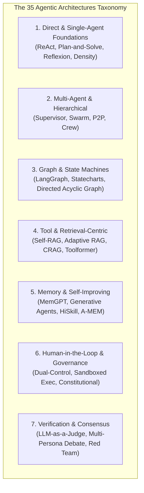
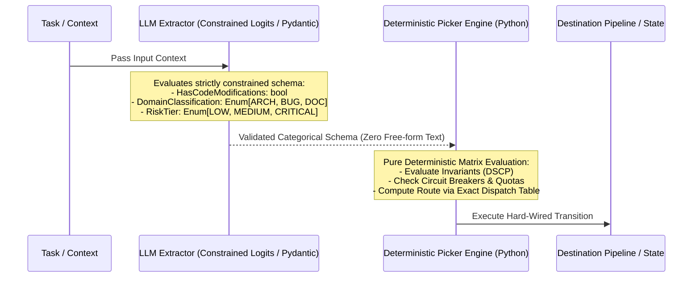
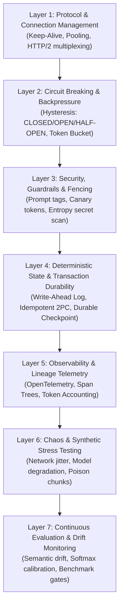
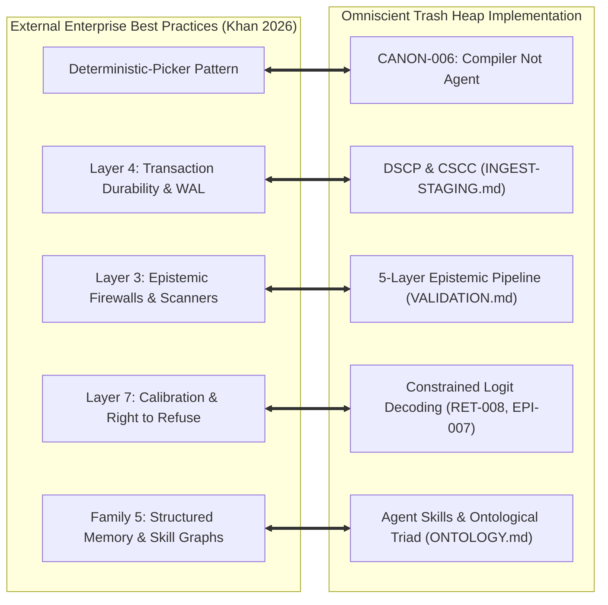

# Research Note: Agentic Architectures & Production-Grade Control Systems

> **Type**: Architectural pattern taxonomy and enterprise systems review — NON-NORMATIVE
> **Source Projects**:
> - [`FareedKhan-dev/all-agentic-architectures`](https://github.com/FareedKhan-dev/all-agentic-architectures) by Fareed Khan (2026)
> - [`FareedKhan-dev/production-grade-agentic-system`](https://github.com/FareedKhan-dev/production-grade-agentic-system) by Fareed Khan (2026)
> **Date**: 2026-09-08
> **Informs**: `specs/ARCHITECTURE.md` (CANON-006, 7-Layer Architecture), `specs/INGEST-STAGING.md` (Durable Staged Commit Protocol / CSCC), `specs/VALIDATION.md` (5-Layer Epistemic Firewall), `specs/RETRIEVAL.md` (Deterministic Routing & Verification).

---

## 1. Executive Summary

This note synthesizes architectural insights from Fareed Khan's comprehensive survey of **35 Agentic Architectures** and his enterprise reference implementation of a **Production-Grade Agentic System**.

Across both projects, the core empirical conclusion mirrors the founding premise of *The Omniscient Trash Heap*:
> **Unbounded agent autonomy is a liability in production.** Resilient cognitive systems separate stochastic semantic perception from deterministic state transition, persistence, and verification.

Khan's work demonstrates that reliable enterprise agent systems require:
1. **The Deterministic-Picker Pattern:** Eliminating generative routing drift by requiring models to emit categorical, constrained enum/boolean commitments, while deterministic state machines compute graph traversal and routing weights.
2. **The 7 Enterprise Production Layers:** Wrapping stochastic model harnesses in industrial infrastructure (circuit breaking, connection pooling, prompt fencing, durable checkpointing, distributed telemetry, synthetic stress testing, and calibration monitoring).

---

## 2. Taxonomy of 35 Agentic Architectures

Khan structures the modern landscape of LLM agent architectures into **seven distinct functional families**:

### 2.1 Family Breakdown & Production Characterization

| Family | Notable Architectures | Enterprise Strengths | Production Failure Modes |
|---|---|---|---|
| **1. Direct / Single-Agent** | ReAct, Plan-and-Solve, Self-Refine, Reflexion, Chain-of-Density | Low token overhead, minimal orchestration latency | Trajectory cycling, infinite self-refinement loops, cognitive drift |
| **2. Multi-Agent Collaborative** | Supervisor-Worker, Hierarchical Agent Teams, Swarm, Peer-to-Peer | Functional specialization, modular prompt contexts | Exponential token consumption, coordination deadlocks, conversational entropy |
| **3. Graph & Workflow Engines** | Deterministic State Machines, LangGraph, Dynamic DAGs, Hierarchical Statecharts | Bounded execution paths, auditability, reproducible transitions | Rigid state explosion, brittle error-recovery branches |
| **4. Tool & Retrieval-Augmented** | Self-RAG, Adaptive RAG, Corrective RAG (CRAG), Toolformer, Chameleon | Live ground-truth grounding, reduced hallucination rate | Context window pollution, retrieval noise amplification, latency spikes |
| **5. Memory & Self-Improving** | MemGPT, Generative Agents, Reflexion Long-term Memory, HiSkill | Longitudinal learning, cross-session continuity | Unbounded memory pollution, epistemic echo chambers, consolidation latency |
| **6. Human-in-the-Loop & Governance** | Dual-Key Approval Gates, Constitutional AI, Sandbox Isolation | Provable compliance, absolute action containment | Human operational bottleneck, approval fatigue, latency degradation |
| **7. Verification & Consensus** | Multi-Persona Debate, LLM-as-a-Judge, Self-Consistency, Red Teaming | Superior calibration, reduced false-positive rate | $N\times$ inference cost, consensus on shared cognitive illusions |

---

## 3. The Deterministic-Picker Pattern

A primary contribution of `all-agentic-architectures` is the formalization of the **Deterministic-Picker Pattern** (Hybrid Neural-Deterministic Control), solving the pervasive **flat-band generative routing pathology**.

### 3.1 The Flat-Band Generative Routing Pathology
When an LLM is tasked with selecting routing paths via free-form text or unconstrained scalar scoring:
$$\text{Score}(A) = 0.812, \quad \text{Score}(B) = 0.810$$
In this "flat band", trivial perturbations in context (prompt token order, system timestamps, temperature variance) cause stochastic routing flips. Even worse, generative agents frequently hallucinate non-existent tool names or invalid transition states.

### 3.2 The Deterministic-Picker Resolution
The Deterministic-Picker Pattern decouples semantic extraction from route selection:

1. **Structured Categorical Output:** The LLM produces strictly constrained boolean flags and enumerated categorical states (validated via Pydantic or constrained logit masks).
2. **Deterministic Dispatch:** A pure Python state machine evaluates categorical flags against invariant tables, role-based permissions, and circuit breakers.
3. **Provable Invariance:** State transitions become completely reproducible, auditable, and unit-testable without mocking generative model behavior.

---

## 4. The 7 Production-Grade Agentic Layers

In `production-grade-agentic-system`, Khan details the seven operational hardening layers necessary to run agent systems under real-world enterprise constraints:

### 4.1 Layer 1: Protocol & Connection Management
- **HTTP/2 & Socket Reuse:** Maintains warm TLS connections to model inference providers, eliminating 150–300 ms handshake overhead per agent invocation.
- **Connection Pool Exhaustion Defenses:** Caps active concurrent inference requests per provider to prevent thread-pool starvation.

### 4.2 Layer 2: Circuit Breaking & Backpressure
- **Hysteresis Circuit Breaker:** Implements standard triple-state automata (`CLOSED`, `OPEN`, `HALF-OPEN`):
  - Five consecutive 5xx or timeout errors trip the circuit to `OPEN`.
  - In `OPEN` state, requests fail immediately without calling upstream APIs, executing local fallback heuristics (e.g., BM25 search or rule-based routing).
  - After a cooldown window, `HALF-OPEN` admits canary requests to evaluate provider recovery.
- **Token Bucket Rate Limiting:** Enforces client-side rate limits matching provider tier constraints, with jittered exponential backoff to prevent "thundering herd" synchrony.

### 4.3 Layer 3: Security, Guardrails & Prompt Fencing
- **Prompt Fencing via Rigid XML Enclosures:** Encapsulates all untrusted external content (user notes, raw web text, repository files) in strict, escaped XML blocks (`<untrusted_content_payload>`).
- **Canary Token Leakage Detection:** Injects high-entropy pseudo-random tokens into system prompt boundaries. If an agent emits the canary string in downstream tool arguments or responses, the session is terminated as a prompt injection breach.
- **Entropy-Based Secret Scrubbing:** Runs Shannon entropy filters over model inputs and outputs to prevent inadvertent leakage of API keys, private keys, and passwords.

### 4.4 Layer 4: Deterministic State & Transactional Durability
- **Write-Ahead Logging (WAL) & Event Sourcing:** Every agent decision, tool invocation, and scratchpad state is appended to a durable WAL prior to execution.
- **Idempotency Keys:** Every external mutating action carries a deterministic UUID hashed from `(step_id, action_name, argument_payload)`. Retries replay cached responses rather than re-executing side effects.
- **Durable Checkpointing (The "Ralph Loop" Pattern):** Monotonic state saves allow interrupted or crashed workflows to resume from the last certified state rather than restarting from zero.

### 4.5 Layer 5: Observability, Lineage & Telemetry
- **Distributed Spans with OpenTelemetry:** Standardized `trace_id` and `span_id` propagate across multi-agent boundaries.
- **Causal Lineage Graphs:** Every generated claim or fact records its complete provenance DAG: `Raw Chunk → Extraction Span → Dedup Step → Promotion Gate`.
- **Token Economics Tracking:** Real-time metrics monitor input/output token expenditure per domain, session, and user.

### 4.6 Layer 6: Chaos & Synthetic Stress Testing
- **Latency Jitter Simulation:** Injects synthetic delays (500 ms to 5000 ms) to verify timeout handling and asynchronous non-blocking behavior.
- **Upstream Failure & Truncation Injection:** Injects truncated completions, invalid JSON payloads, and HTTP 429/503 errors to test circuit breaker and fallback paths.
- **Adversarial Poison Injection:** Injects synthetically conflicting facts into retrieved chunks to test epistemic refusal and contradiction detection.

### 4.7 Layer 7: Continuous Evaluation & Drift Monitoring
- **Softmax Posterior Calibration:** Continuous tracking of model confidence distribution $P(y)$ across canary questions to detect model degradation or API drift.
- **Automated Regression Gates:** Nightly CI test runs against held-out benchmark datasets (e.g., PubMedQA, code syntax test suites).

---

## 5. Architectural Alignment with *The Omniscient Trash Heap*

Khan's findings provide external validation for key design decisions in *The Omniscient Trash Heap*:

### 5.1 CANON-006: The Ultimate Deterministic Picker
Khan's Deterministic-Picker Pattern is the exact operational manifestation of our **CANON-006** axiom:
> *"The LLM only reasons — it never touches the filesystem directly. All page creation, slugging, merging, and backlink maintenance is deterministic Python."*

By restricting model outputs to Pydantic-validated extraction schemas and delegating state graph traversal to deterministic Python algorithms, *The Omniscient Trash Heap* avoids the failure modes that plague pure agentic frameworks (Swarm, CrewAI, AutoGen).

### 5.2 Transaction Durability (CSCC & DSCP)
Khan's Layer 4 requirements match our **Continuous Staged Commit Coordinator (CSCC)** and **Durable Staged Commit Protocol (DSCP)** (`specs/INGEST-STAGING.md`):
- Multi-phase staged commits (`STAGED` $\rightarrow$ `LINTED` $\rightarrow$ `COMMITTED`).
- Write-ahead logs recording all file mutations with rollback guarantees.
- Checkpointed state enabling crash resilience identical to Oliver's "Ralph Loop".

### 5.3 Epistemic Firewalls & Validation
Khan's Layer 3 security protocols are embodied in our 5-layer validation engine (`specs/VALIDATION.md`):
- Structural syntax validation (Layer 1).
- Frontmatter schema validation (Layer 2).
- Ontological & semantic constraint validation (Layer 3).
- Shannon entropy secret filtering & prompt injection detection (Layer 4).
- Referential integrity & cross-link graph certification (Layer 5).

---

## 6. Synthesis & Summary Table

| Operational Domain | Pure Agentic Approach (Fragile) | Production-Grade Hardening (Khan 2026) | Omniscient Trash Heap Specification |
|---|---|---|---|
| **Graph Routing** | LLM generates next action / tool name in free text | **Deterministic Picker**: LLM emits categorical enum; Python routes | **CANON-006** / Deterministic Graph Traversal |
| **Pipeline Reliability** | Uncaught exceptions abort multi-step agent run | **Circuit Breaker + Retries**: Hysteresis, backoff, fallbacks | **CSCC** transaction retry & fallback heuristics |
| **State Persistence** | Ephemeral in-memory conversational history | **Durable WAL & Checkpoints**: Monotonic progress state | **DSCP** staged commits & durable JSONL journal |
| **Tool Execution** | Arbitrary shell / Python execution permissions | **Sandboxed Fencing**: Role-based access control & tags | **E120 Capability Firewall** & non-invasive observation |
| **Confidence & Refusal** | Generative text parsing (`"Yes"`, `"No"`) | **Softmax Logit Decoding**: Renormalized mathematical posteriors | **RET-008** / **EPI-007** Constrained Logit Decoding |
