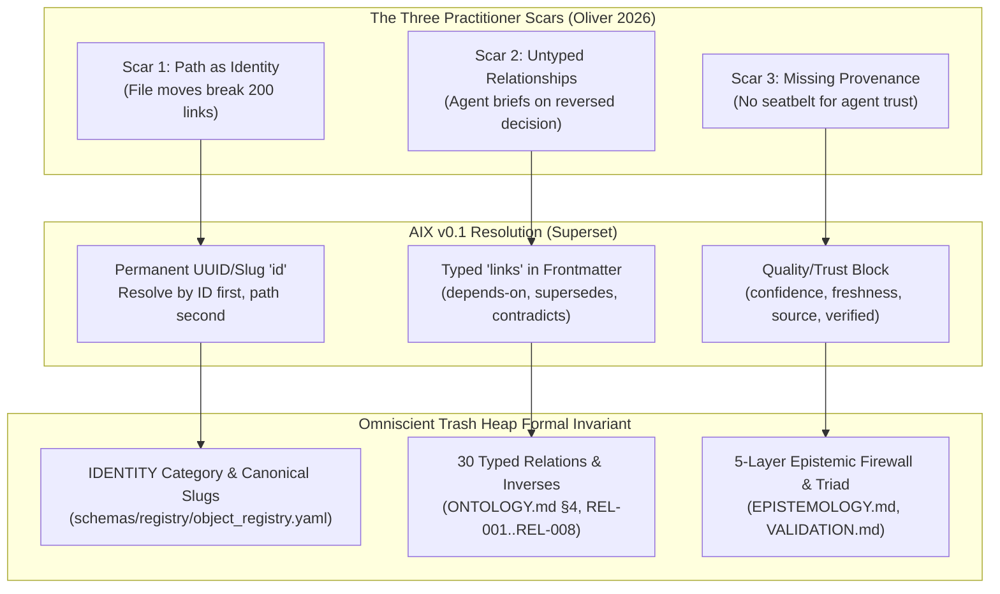

# Research Note: AIX, the OKF Superset Strategy & Practitioner Scars

> **Type**: Standard superset analysis, empirical failure mode catalog, and provenance record — NON-NORMATIVE
> **Source Document**: *"I Was Going to Adopt Google’s Knowledge Format. I Wrote a Superset Instead."* by David R Oliver (July 18, 2026)
> **Referenced Standards**: Google Open Knowledge Format (OKF v0.1 / v0.2), AIX v0.1 (AI eXchange format), CommonMark, YAML Frontmatter.
> **Date**: 2026-09-08
> **Informs**: `specs/OKF-INTEROP.md` (OKF-001–OKF-010), `specs/ONTOLOGY.md` (§4 Typed Relations, REL-004/REL-004a), `specs/SCHEMA.md` (Identity & Slug Invariance), `specs/VALIDATION.md` (Layer 2 & Layer 5 Invariants), `specs/ARCHITECTURE.md` (CANON-006).

---

## 1. Executive Summary

On July 18, 2026, following Google Cloud's initial release of the **Open Knowledge Format (OKF v0.1)**, David R Oliver published an analysis of why a minimal standard designed for *knowledge interchange between systems* fails when applied to *in-place reasoning by autonomous agents*.

Rather than rejecting OKF and creating a fragmented competitor, Oliver introduced **AIX (AI eXchange)** as a strict **superset** of OKF:
> *"Don't fork down. Superset up. Publish once. Consumed by both."*

Oliver identified three critical omissions in OKF v0.1—termed **"practitioner scars"**—that render unaugmented Markdown folders dangerous for reasoning agents:
1. **Path-as-Identity Fragility:** Identifying concepts by relative filesystem path causes catastrophic reference breakage whenever notes are refactored, archived, or moved.
2. **Untyped Link Blindness:** Treating all relationships as generic bidirectional hyperlinks allows agents to hallucinate reversed decisions (e.g., treating a superseded policy as active).
3. **Epistemic Amnesia (Missing Provenance):** The total absence of trust, authorship, review, and freshness metadata forces agents to treat rapid personal hunches with the same epistemic weight as verified canonical facts.

This document analyzes the mechanics of AIX v0.1, the conformance ladder, the deliberate redundancy rule, and demonstrates how *The Omniscient Trash Heap* anticipated, hardened, and formalized these exact practitioner scars into mathematical invariants.

---

## 2. The Three Practitioner Scars of OKF v0.1

Oliver articulates the foundational divergence between a *transport floor* and a *reasoning ceiling*:
> *"A working vault discovers the ceiling before a standards body writes down the floor. Not because the practitioner is cleverer, but because the practitioner is cornered."*



### 2.1 Scar 1: Path as Identity (Filesystem Fragility)
In OKF v0.1, a concept is uniquely identified by its relative path (e.g., `wiki/architecture/database.md`).
- **Failure Mode:** In any living system, notes undergo continuous lifecycle migrations: moving from `inbox/` to `staging/`, being renamed during semantic refinement, or moving into `archive/`. Path-based addressing shatters referential integrity across the entire graph.
- **The AIX Fix:** Every document assigns a permanent, immutable `id:` in its frontmatter. Link resolution algorithms search by ID first, and fallback to path only if ID is missing.
- **Trash Heap Implementation:** Fully formalized under `specs/SCHEMA.md` and `IDENTITY` frontmatter. Every entity is bound to an immutable UUID and canonical slug. Physical path mutation never severs relational edges.

### 2.2 Scar 2: Untyped Links (The Reversed Decision Catastrophe)
In OKF v0.1, relationships are expressed exclusively as untyped Markdown links (`[target](target.md)`).
- **Failure Mode:** An untyped edge asserts only that two concepts are associated. It cannot distinguish between:
  - $A \xrightarrow{\text{depends-on}} B$
  - $A \xrightarrow{\text{supersedes}} B$
  - $A \xrightarrow{\text{contradicts}} B$
  Oliver documented that an agent operating over untyped links confidently briefed him on an architectural decision that he had explicitly reversed in a subsequent note.
- **The AIX Fix:** Frontmatter defines explicit `links:` containing edge types (`depends-on`, `supersedes`, `contradicts`, `part-of`) with defined mathematical inverses.
- **Trash Heap Implementation:** Formalized under `specs/ONTOLOGY.md` §4 with **30 registry-governed typed relations** spanning 6 orthogonal families. Invariants `REL-004` and `REL-004a` strictly regulate virtual inverse generation and prevent cycle pathologies.

### 2.3 Scar 3: Epistemic Amnesia (The Missing Trust Block)
In OKF v0.1, all text is epistemically uniform.
- **Failure Mode:** An agent cannot discern whether a claim represents:
  - An empirical production measurement.
  - A speculative brainstorming hunch written in haste.
  - A deprecated historical convention.
- **The AIX Fix:** Frontmatter introduces a quality/trust block: `confidence` (high/medium/low), `freshness`, `source`, `verified` (boolean/actor), and `reviewed`.
- **Trash Heap Implementation:** Formalized under `specs/EPISTEMOLOGY.md` and `specs/VALIDATION.md`. Incorporates Bayesian confidence posteriors, explicit verification stamps (`verified: {by, at}`), temporal validity windows (`stale_after`), and cryptographic AST hash pinning (`SG-013`).

---

## 3. The Superset Strategy: "Don't Fork Down, Superset Up"

Oliver addresses the classic open-standards trap (formalized in XKCD 927: creating a 15th standard to unify the previous 14).

```text
       Google OKF v0.1 (The Permissive Floor)
       ┌────────────────────────────────────────────────────────┐
       │ - type: Concept                                        │
       │ - title, description, tags, timestamp                  │
       │ - Untyped Markdown links: [DB](db.md)                 │
       └─────────────────────────┬──────────────────────────────┘
                                 │ Strict Extension (Superset)
                                 ▼
       AIX v0.1 (The Practitioner Ceiling)
       ┌────────────────────────────────────────────────────────┐
       │ - id: "arch-db-001" (Stable Identifier)                │
       │ - links:                                               │
       │     - target: "arch-storage-002"                       │
       │       type: "depends-on"                               │
       │ - quality:                                             │
       │     confidence: "high"                                 │
       │     verified: true                                     │
       │ - Body includes redundant standard link [DB](db.md)   │
       └────────────────────────────────────────────────────────┘
```

### 3.1 The Deliberate Redundancy Bridge
To guarantee 100% backward compatibility with basic OKF parsers without breaking AIX reasoning capabilities:
- **The Rule:** Every typed frontmatter relationship **must also appear as a standard Markdown link in the body text**.
- **The Payoff:**
  - An OKF-only agent reads the body, sees the edge, and traverses the link normally.
  - An AIX-aware compiler reads frontmatter, extracts the semantic type (`supersedes`), and prunes deprecated branches from agent context.
  - No custom runtime or parser fork is required.

### 3.2 The AIX Conformance Ladder
Oliver structures adoption as an incremental ladder rather than an all-or-nothing requirement:
- **Level 0 (Floor):** Syntactically valid OKF v0.1 Markdown and frontmatter.
- **Level 1 (Identity):** Stable permanent IDs and repository manifest (`manifest.json` / `manifest.yaml`).
- **Level 2 (Semantics & Trust):** Fully typed relational links, defined inverses, and the provenance/quality block.

---

## 4. Comprehensive Comparison: The Evolution to *The Omniscient Trash Heap*

| Architectural Dimension | Google OKF v0.1 (June 2026) | David R Oliver AIX v0.1 (July 2026) | Google OKF v0.2 (August 2026) | The Omniscient Trash Heap (September 2026) |
|---|---|---|---|---|
| **Identity Mechanism** | File path | Stable `id:` in frontmatter | File path (legacy compatibility) | **Immutable UUID + Canonical Slug** (`schemas/registry/`) |
| **Relationship Model** | Untyped Markdown body links | Typed frontmatter links (`supersedes`, `depends-on`) | Untyped body links + `sources:` list | **30 Typed Relations in 6 Families** (`ONTOLOGY.md` §4, bidirectional AST checks) |
| **Inverse Relations** | None | Free inverse synthesis rules | None | **Virtual Inverse Synthesis** (`REL-004`, persisted inverses forbidden) |
| **Trust & Provenance** | None | `confidence`, `freshness`, `verified` | `sources`, `verified: {by, at}`, `stale_after` | **5-Layer Epistemic Pipeline** + Constrained Logits (`EPISTEMOLOGY.md`, `RET-008`) |
| **Grounding Anchor** | None | Prose citations | Source URI string | **AST Hash Pinning** (`SG-013`, sha256 line ranges) |
| **Redundancy Policy** | N/A | Frontmatter edge mirrored in Markdown body | N/A | **Dual-Layer Invariant**: Frontmatter ontology + verified Markdown link |
| **Query & Index Engine** | None (Filesystem only) | SQLite FTS proposal | None (`kcmd` to Google Cloud Catalogue) | **CSR in-memory graphs + SQLite FTS5 + Parquet staging** |
| **Transaction Model** | File overwrite | File overwrite | File overwrite | **Durable Staged Commit Protocol (DSCP / CSCC)** |

---

## 5. Strategic Significance: Why "Over Engineering" is the Only Viable Defense

Oliver’s essay provides the ultimate philosophical defense of our project's deliberate "Over Engineering":

1. **The Floor is Not Enough for Reasoning:** Standards bodies (Google, W3C) necessarily specify the *lowest common denominator* (the floor) to maximize nominal adoption. But unconstrained coding agents operating over minimal floors inevitably break on the three scars: they lose files on rename, reverse architectural decisions, and hallucinate hunches as truth.
2. **Every Over-Engineered Invariant is an Earned Scar:** The 164 tracked invariants, 37 schema families, and 151 unit tests in *The Omniscient Trash Heap* are not speculative complexity—they are the codified, portable scars of real-world cognitive compilation failures.
3. **Supersetting as a Superpower:** By conforming to OKF v0.2 at our boundary layer while enforcing strict epistemic schemas internally, *The Omniscient Trash Heap* achieves universal interoperability without sacrificing cognitive rigor.
