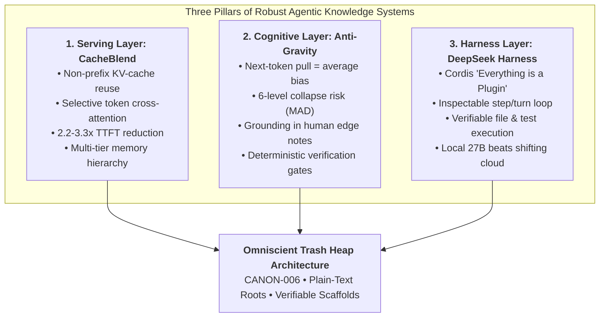
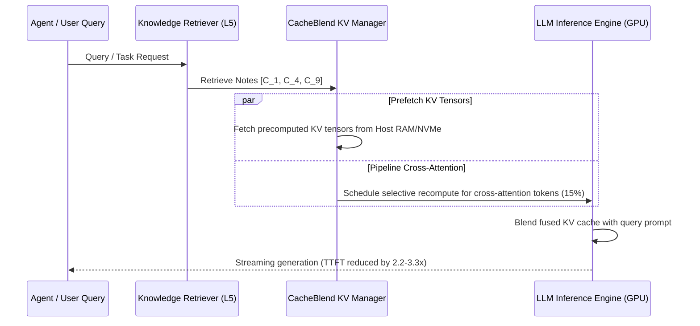
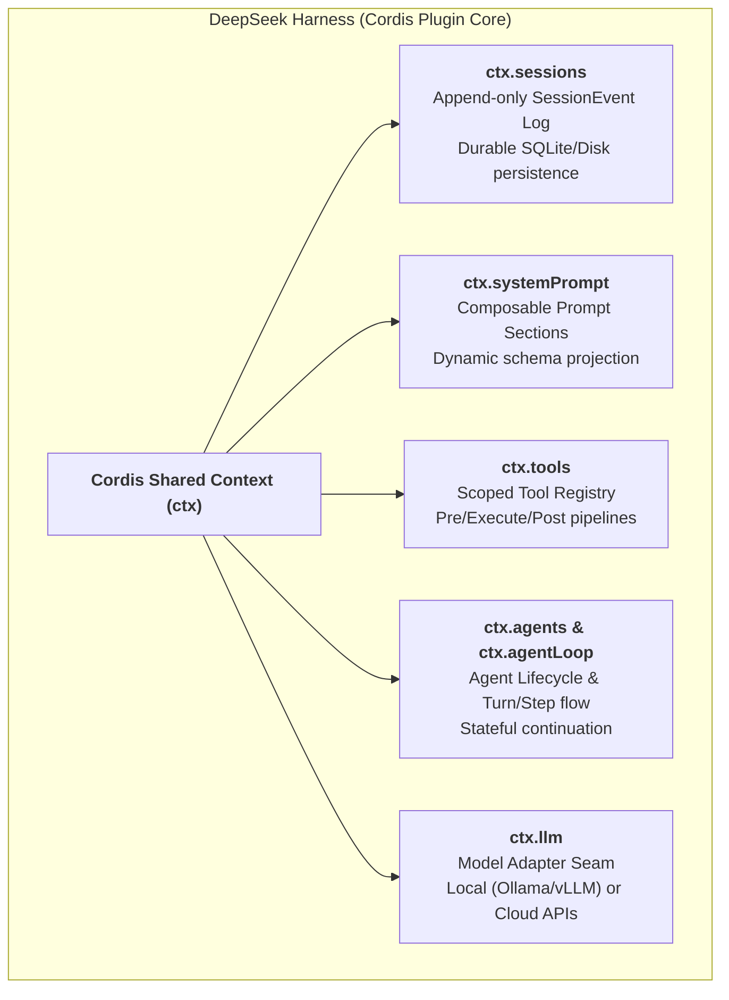

# Research Note P22: CacheBlend RAG Acceleration, Synthetic Gravity Wells, and DeepSeek Harness Plugin Architecture

> **Type**: Non-normative systems serving analysis, cognitive degradation survey, and agent harness architectural teardown  
> **Source Documents**:
>   1. Jiayi Yao, Hanchen Li, Yuhan Liu, Siddhant Ray, Yihua Cheng, Qizheng Zhang, Kuntai Du, Shan Lu, Junchen Jiang, *CacheBlend: Fast Large Language Model Serving for RAG with Cached Knowledge Fusion* (arXiv:2405.16444, May 2024 / UChicago Systems Lab / LMCache)
>   2. Prof. Junchen Jiang (Associate Professor, University of Chicago; Yao Class Tsinghua, PhD CMU) & UChicago AI + Systems Seminar (`https://uchi-jcl.github.io/seminar`, `https://people.cs.uchicago.edu/~junchenj/`)
>   3. Prof. Sanjay Krishnan, *The Devil Has A Long Tail: Part 2* (UChicago AI + Systems Seminar, April 2024; on enterprise LLMs, rare failure modes, and the runaway growth of scaffolding code)
>   4. Hayanan, *Synthetic Gravity: Why AI Keeps Returning to the Same Ideas* (AI Advances, Sept 7, 2026; `https://aiadvances.org/synthetic-gravity-why-ai-keeps-returning-to-the-same-ideas-55a220a5dc3e`)
>   5. Sumit Pandey, *I Tried Viral DeepSeek Harness with Qwen 3.8 27B, and It was Beyond My Imagination* (Towards Deep Learning, Aug 25, 2026; `https://www.towardsdeeplearning.com/i-tried-viral-deepseek-harness-with-qwen-3-8-27b-and-it-was-beyond-my-imagination-85b0b47427e3`)
>   6. DeepSeek AI, *DeepSeek Harness: Everything is a Plugin* (GitHub: `https://github.com/deepseek-ai/deepseek-harness`, powered by Cordis / arXiv:2608.25512)
> **Retrieved**: 2026-09-09  
> **Informs**: `specs/ARCHITECTURE.md` (CANON-006, memory tiers, plain-text baseline vs KV tensor caching), `specs/RETRIEVAL.md` (Multi-chunk RAG serving & TTFT optimization), `specs/AGENT-SKILLS.md` (Plugin composability & tool pipelines), `specs/VALIDATION.md` (Deterministic verification vs scaffolding bloat), `specs/REVIEW-PROMOTION.md` (Fighting synthetic gravity through human grounding).

---

## 1. Executive Summary

This research note synthesizes three major interlocking vectors from late 2024 to late 2026 across systems research, generative cognition, and agent runtime harnesses:

1. **Systems-Level RAG Serving via Knowledge Fusion (CacheBlend & Junchen Jiang's Lab):**  
   Retrieval-Augmented Generation routinely retrieves multiple disparate knowledge chunks that are not positioned at prefix 0. Traditional prefix KV-caching fails because cross-attention dynamically couples tokens across chunks. CacheBlend (Yao et al., arXiv:2405.16444) solves this by reusing precomputed chunk KV-caches regardless of order or position, selectively recomputing cross-attention on a small token subset, and pipelining recompute delay with multi-tier storage retrieval. This achieves a 2.2–3.3x TTFT latency reduction and 2.8–5x throughput improvement without generation quality loss.
2. **The "Synthetic Gravity" Trap and the Scaffolding Crisis (Hayanan & Sanjay Krishnan):**  
   Language models are fundamentally statistical predictors of the most likely next token, which exerts an inward "synthetic gravity" pulling outputs toward the average, bland center and erasing distinctive outliers. This collapse manifests across six scales (repetition loops, mode collapse, style homogenization, visual averaging, cultural clustering, and recursive model collapse / *Model Autophagy Disorder*). Concurrently, enterprise attempts to patch this through unconstrained ad-hoc scaffolding replicate distributed systems' "devil with a long tail," creating unmaintainable software bloat.
3. **The Open, Composable Agent Runtime (DeepSeek Harness & Cordis):**  
   DeepSeek Harness (`dsh`) demonstrates that "the harness is the product" by structuring the entire agent runtime on the **Cordis** micro-kernel architecture where *everything is a plugin*. By isolating the model behind an inspectable loop (read actual line numbers, execute sandboxed bash, observe test results, self-correct), a local 27B model (e.g. Qwen 3.8 on a 128GB DGX Spark) consistently outperforms opaque, shifting frontier cloud models on verifiable engineering tasks.

---

## 2. Deep-Dive: CacheBlend & Systems-Level RAG Serving

### 2.1 The Non-Prefix KV-Cache Bottleneck in RAG
Standard Large Language Model inference requires an expensive prefill phase to compute Key-Value (KV) attention activations for all prompt tokens. While KV-cache reuse is trivial when multiple requests share an identical prefix (Prompt Prefix Caching), practical RAG systems invalidate this assumption:
- A user query retrieves $k$ independent documents or knowledge cards ($C_1, C_2, \dots, C_k$).
- The combination, ordering, and query context vary dynamically per request.
- While the KV-cache of $C_2$ might have been precomputed in isolation, placing $C_2$ after $C_1$ introduces cross-attention from tokens in $C_2$ attending to tokens in $C_1$.
- Previously, serving engines (e.g., vLLM, TensorRT-LLM) were forced to either discard cached KV states and recompute the entire concatenated sequence from scratch, or suffer significant semantic hallucination by ignoring cross-attention.

### 2.2 The CacheBlend Mechanism (arXiv:2405.16444)
Jiayi Yao, Hanchen Li, Junchen Jiang, and collaborators developed **CacheBlend** within the LMCache ecosystem:
1. **Cached Knowledge Fusion:** Reuses precomputed KV caches of individual chunks irrespective of their position in the prompt context.
2. **Selective Cross-Attention Recomputation:** Identifies that cross-attention is heavily concentrated on a small fraction of critical tokens (primarily boundary tokens, delimiter markers, and high-attention sink tokens). CacheBlend selectively recomputes only this small subset ($\approx 10\text{--}20\%$ of tokens) to update the attention matrix while leaving the remainder untouched.
3. **Pipelined Retrieval and Compute:** The minor computation time required to update cross-attention tokens is overlapped (pipelined) with the asynchronous retrieval of KV tensors from host RAM or NVMe storage. Slower, high-capacity storage tiers can thus be utilized without exposing disk I/O latency to the user.

### 2.3 Empirical Results & Architectural Implications
- **Latency & Throughput:** Across Llama-2-7B, Mistral-7B, and Llama-3-8B across four diverse RAG benchmarks, CacheBlend cuts Time-To-First-Token (TTFT) by **2.2x to 3.3x** and expands serving throughput by **2.8x to 5.0x** compared to full prefill.
- **Generation Quality:** Evaluated against full recomputation across Rouge-1, Rouge-L, and exact match metrics, CacheBlend exhibits zero statistically significant degradation in answer accuracy.
- **Trash Heap Integration:** Directly bridges our disk-first plain-text canonical notes with serving systems. In [`specs/RETRIEVAL.md`](file:///home/daniel6651/omniscient-trash-heap-spec/specs/RETRIEVAL.md) and [`specs/ARCHITECTURE.md`](file:///home/daniel6651/omniscient-trash-heap-spec/specs/ARCHITECTURE.md), canonical knowledge remains immutable Markdown on disk, while local or shared serving nodes leverage CacheBlend to fuse multi-card contexts at microsecond scales.

---

## 3. The UChicago AI+Systems Perspective: "The Devil Has A Long Tail"

In the University of Chicago AI + Systems Seminar, Prof. Sanjay Krishnan presented *The Devil Has A Long Tail: Part 2*, connecting current enterprise LLM failures with the historical trajectory of distributed cloud databases:

1. **The Distributed Deal with the Devil:** Early NoSQL / eventually-consistent cloud services promised infinite instant scalability, but offloaded the agonizing complexity of concurrency bugs, split-brains, and silent inconsistencies to application developers.
2. **The LLM Deal with the Devil:** Enterprise LLM adoption promises instant generality and zero-shot problem solving. In reality, it introduces a brutal "long tail" of rare, non-reproducible ML failure modes, silent degradation, and context-dependent bugs.
3. **The Cancer of Scaffolding Growth:** When models fail on edge cases, developers instinctually wrap them in reactive prompt patches, defensive guards, and heuristic retry loops. Over time, this scaffolding metastasizes into an unmaintainable, brittle labyrinth that obscures core system logic without actually solving the underlying failure modes.

**Trash Heap Alignment:**  
This reinforces our foundational axiom **CANON-006** (*Deterministic Outer Shell, Statistical Core*). The antidote to scaffolding rot is not more prompts or dynamic agent wrappers, but strict, formal, deterministic compiler gates:
- Explicit YAML registries (`object_registry.yaml`, `facet_registry.yaml`)
- Strict schema linters (`linter.py`) verifying invariant rules
- ARIES-style write-ahead state machines (`CSCC`/`DSCP` in `specs/INGEST-STAGING.md`)
- Complete isolation between unstructured ingestion and canonical promotion.

---

## 4. Deep-Dive: Synthetic Gravity and Model Autophagy

Hayanan's treatise *Synthetic Gravity: Why AI Keeps Returning to the Same Ideas* provides a rigorous theoretical synthesis of why ungrounded LLM knowledge curation inevitably decays.

### 4.1 The Physics of Synthetic Gravity
Next-token prediction is an optimization function that rewards predicting the most statistically probable continuation. This prediction is not neutral; it functions as a gravitational vector directing all generative output toward the center of the training distribution:
$$\vec{F}_{\text{synthetic}} \propto -\nabla P(\text{token} \mid \text{context})$$

Left uninhibited, the model slides downhill into the deepest probability well, shedding unique stylistic markers, unusual conceptual associations, and critical edge cases.

### 4.2 The Six Manifestation Scales

| Scale | Manifestation | Foundational Literature | Mechanism & Impact |
|---|---|---|---|
| **1. Word Level** | Greedy Repetition Loops | Holtzman et al. (*arXiv:1904.09751*, 2019) | Maximizing probability leads to degenerate looping ("the cat sat on the mat..."). Forced introduction of temperature (stochastic push) is required to climb out of the well. |
| **2. Answer Level** | Mode Collapse / Diversity Collapse | Kirk et al. (2024) | Post-RLHF alignment rewards safe, agreeable responses, drastically narrowing the range of outputs across users and brainstorming sessions. |
| **3. Style Level** | Homogenized Voice & Vocabulary Spikes | Dmitry Kobak et al. (*Nature Human Behaviour*, 2024/2025) | Emergence of artificial vocabulary fingerprints (e.g. explosive spike in "delve", "underscore", "realm"). Drives human-LLM coevolution where humans unconsciously mimic AI style. |
| **4. Visual Level** | Algorithmic Lookism & Aesthetic Narrowing | Bohacek & Farid (*arXiv:2601.11651*, 2024) | Image generators roll to the statistical center of attractiveness; retraining Stable Diffusion on self-generated faces collapses diversity into a single artificial template. |
| **5. Cultural Level** | Individual Uplift vs Collective Homogenization | Doshi & Hauser (*Science Advances*, 2024) | Generative AI enhances individual writer novelty while simultaneously collapsing the collective variance of stories across groups. |
| **6. Civilization Level** | Model Autophagy Disorder (MAD) / Habsburg AI | Shumailov et al. (*Nature 631*, 2024) | Recursive training of LLMs on synthetic web text strips the distribution tails, culminating in irreversible defect accumulation and total semantic collapse. |

### 4.3 Defeating Synthetic Gravity in `llm-wiki-oe`
If a knowledge base relies purely on LLM agents summarizing internet articles and then cross-summarizing those summaries, the repository collapses into a low-entropy synthetic gravity well.

`llm-wiki-oe` counteracts this through five deliberate architectural mechanisms:
1. **Durable Human Grounding (`scope: personal`):** Protects raw, idiosyncratic human notes, debugging logs, personal opinions, and incident post-mortems as first-class, immutable knowledge objects.
2. **Epistemic Isolation (`EPISTEMOLOGY.md`):** Distinguishes ungrounded claims (`PROV-001`) from verified empirical evidence (`Incident`, `Lesson`).
3. **Adversarial Review Triad (`REVIEW-PROMOTION.md`):** Uses opposing agents (e.g. builder agent vs adversarial reviewer) to aggressively challenge consensus summaries and surface edge conditions.
4. **Deterministic Linting over Agent Consensus:** Validates schema invariants, link integrity, and facet orthogonality using deterministic Python/Rust parsers rather than LLM self-grading.
5. **Raw Material Preservation (`research/raw/`):** Original source texts are preserved verbatim (via `medium_fetch.py`, raw PDF archives) to enable recompilation from source truth whenever model capabilities advance.

---

## 5. Deep-Dive: DeepSeek Harness (`dsh`) & Cordis Plugin Architecture

### 5.1 The Shift from Cloud Chat to Local Harness
Sumit Pandey's empirical evaluation (*I Tried Viral DeepSeek Harness with Qwen 3.8 27B*) documents a critical industry inflection point:
- **Cloud Chat Brittleness:** Proprietary cloud services (such as Claude Opus/Sonnet) frequently experience silent behavioral drift due to unannounced system prompt edits, backend telemetry tweaks, rate throttling, and context-clearing "optimizations." The user is a passenger on hidden changes.
- **The "Narrating vs Doing" Failure Mode:** Models in chat interfaces frequently hallucinate completion—generating polite, eloquent descriptions of code changes while leaving the underlying files untouched.
- **The Decoupled Quality Equation:**
  $$\text{System Utility} = \text{Model Quality} \times \text{Harness Quality} \times \text{Context Quality} \times \text{Iteration Speed}$$
  A 27B local open model (e.g., Qwen 3.8 on a 128GB DGX Spark) paired with a high-fidelity, inspectable harness with zero token cost and instant iteration consistently outperforms an uninspected frontier cloud model on real-world engineering refactoring.

### 5.2 DeepSeek Harness Architecture Breakdown
DeepSeek Harness (`dsh`) is engineered around **Cordis**—a spatiotemporal microkernel architecture (*A Programming Paradigm for Spatiotemporal Composability*, arXiv:2608.25512). In `dsh`, **everything is a plugin**:

### 5.3 Verifiable Agent Step-Turn Execution Loop
Unlike chat wrappers that feed unvalidated text back and forth, `dsh` enforces an explicit state machine at every step:
1. **Turn Start:** Claims next input, resolves queued messages, and projects runtime context.
2. **Pre-Step Validation:** `agent/pre-step` hook validates input structure; rejects malformed inputs before invoking the LLM.
3. **Execution Pipeline:**
   $$\text{tool/call} \longrightarrow \text{tools/pre-execute} \longrightarrow \text{tools/execute} \longrightarrow \text{tools/post-execute} \longrightarrow \text{tool/result}$$
4. **Sandboxed Verification:** Shell tools run within sandboxed environments with strict approval policies. Diffs are verified against disk, and test execution output is fed back directly into the agent context for autonomous self-correction.
5. **Turn Completion:** The turn closes only when no tools owe further requests and all assertions have settled.

---

## 6. Synthesis: Cross-Cutting Architectural Takeaways for `llm-wiki-oe`

| Research Insight | Source | Architectural Adoption in `llm-wiki-oe` | Spec / Implementation Link |
|---|---|---|---|
| **Non-Prefix KV Caching** | CacheBlend (Yao et al., arXiv:2405.16444) | Multi-chunk RAG serving strategy; precomputing and fusing distinct knowledge card KV tensors with pipelined cross-attention updates. | [`specs/RETRIEVAL.md`](file:///home/daniel6651/omniscient-trash-heap-spec/specs/RETRIEVAL.md) (§5, §9.7), [`specs/ARCHITECTURE.md`](file:///home/daniel6651/omniscient-trash-heap-spec/specs/ARCHITECTURE.md) |
| **Anti-Scaffolding Discipline** | Prof. Sanjay Krishnan (UChicago AI+Sys) | Replaces runaway heuristic agent prompts with deterministic compiler linters and ARIES-style write-ahead journals (`CSCC`/`DSCP`). | [`specs/ARCHITECTURE.md`](file:///home/daniel6651/omniscient-trash-heap-spec/specs/ARCHITECTURE.md) (**CANON-006**), [`specs/INGEST-STAGING.md`](file:///home/daniel6651/omniscient-trash-heap-spec/specs/INGEST-STAGING.md) |
| **Synthetic Gravity Defeat** | Hayanan (AI Advances, Sept 2026) | Preserves raw human idiosyncratic sources (`scope: personal`, incident logs), prevents recursive summary degradation (MAD), and enforces adversarial dual-agent review. | [`specs/REVIEW-PROMOTION.md`](file:///home/daniel6651/omniscient-trash-heap-spec/specs/REVIEW-PROMOTION.md), [`specs/EPISTEMOLOGY.md`](file:///home/daniel6651/omniscient-trash-heap-spec/specs/EPISTEMOLOGY.md) |
| **Plugin-Driven Agent Runtime** | DeepSeek Harness (`dsh` / Cordis) | Decouples agent capabilities into composable tool plugins with strict pre/execute/post validation hooks, verifiable diffs, and local execution options. | [`specs/AGENT-SKILLS.md`](file:///home/daniel6651/omniscient-trash-heap-spec/specs/AGENT-SKILLS.md), [`specs/INGEST-ADAPTERS.md`](file:///home/daniel6651/omniscient-trash-heap-spec/specs/INGEST-ADAPTERS.md) |
| **Local Hardware Viability** | Sumit Pandey (DGX Spark + Qwen 27B) | Verifies that local 27B+ parameter models inside deterministic tool harnesses can fully execute wiki maintenance, linting, and extraction tasks without proprietary cloud dependencies. | [`specs/ARCHITECTURE.md`](file:///home/daniel6651/omniscient-trash-heap-spec/specs/ARCHITECTURE.md) (§2.3), [`specs/INGEST-PIPELINE.md`](file:///home/daniel6651/omniscient-trash-heap-spec/specs/INGEST-PIPELINE.md) |
