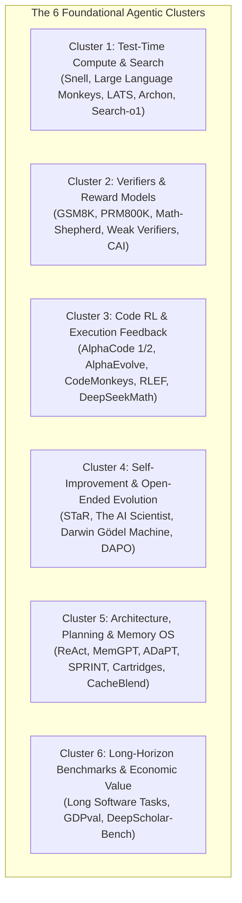
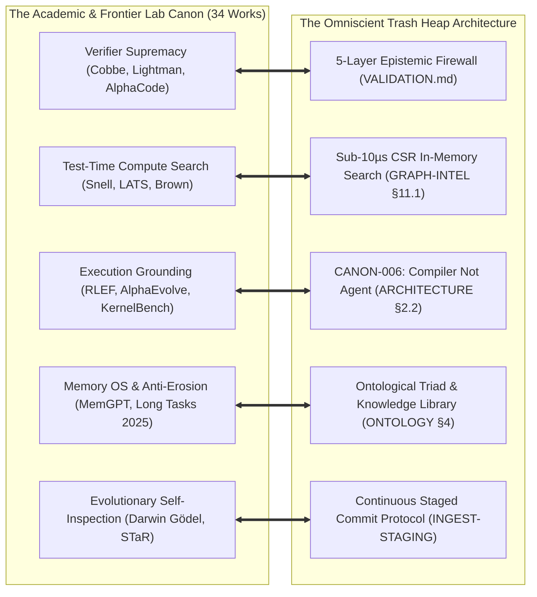

# Research Note: Frontier Agentic Foundations, Test-Time Compute Scaling & Autonomous Evolution

> **Type**: Comprehensive literature survey, mathematical scaling review, and architecture mapping — NON-NORMATIVE
> **Corpus Analyzed**: 34 foundational papers and technical reports (2021–2026) spanning OpenAI, Google DeepMind, Anthropic, Stanford, Sakana AI, UC Berkeley, and Princeton.
> **Date**: 2026-09-08
> **Informs**: `specs/ARCHITECTURE.md` (CANON-006 Compiler Paradigm), `specs/VALIDATION.md` (5-Layer Uncheatable Verifiers), `specs/GRAPH-INTELLIGENCE.md` (§11.1 Sub-10$\mu$s CSR Test-Time Search), `specs/RETRIEVAL.md` (Constrained Decoding & Right-to-Refuse), `specs/ONTOLOGY.md` (§4 Ontological Triad & Anti-Erosion), `specs/INGEST-STAGING.md` (Durable Staged Commit Protocol & CSCC).

---

## 1. Executive Summary

This survey synthesizes the 34 landmark papers and technical reports that establish the theoretical and empirical foundation of modern agentic systems.

Across five years of frontier AI research, a singular paradigm shift has occurred:
> **The frontier scaling law has pivoted from pre-training parameter scale ($N_{\text{params}}$) to test-time compute scaling, tree-search deliberation, deterministic verification, and closed-loop execution feedback ($T_{\text{inference}} \times V_{\text{verifier}}$).**

A language model alone is a stochastic token predictor. An **autonomous cognitive agent** emerges only when that predictor is encapsulated within an **uncheatable external control harness**:
1. **The Generation-Verification Gap:** Verifying an answer or state is fundamentally easier and more robust than generating it from scratch, provided the verifier is deterministic and non-neural (OpenAI GSM8K, PRM800K, Weak Verifiers 2025).
2. **Test-Time Compute Beats Parameter Scaling:** Scaling repeated sampling, adaptive tree search (LATS, MCTS), and verification at inference time yields greater accuracy gains per FLOP than scaling model size by $10\times$ (Snell et al. 2024, Large Language Monkeys 2024).
3. **Execution Feedback as Ground Truth:** Code generation, mathematical proof, and knowledge compilation must be grounded in physical execution (compilation, test pass/fail, GPU kernel profiling) rather than circular LLM self-evaluation (AlphaCode 1/2, AlphaEvolve, RLEF, KernelBench).
4. **Hierarchical Memory Defeats Long-Horizon Erosion:** Bounded context windows cause models to degrade exponentially over multi-step tasks. Resolving this requires operating-system-level hierarchical memory paging and compaction (MemGPT, Cartridges, CacheBlend, Ontological Triad).
5. **Open-Ended Self-Improvement:** True self-improvement requires formal evolutionary harnesses that mutate their own prompts/code, subject to strict survival criteria and transaction rollback (STaR, The AI Scientist, Darwin Gödel Machine).

---

## 2. Taxonomy of the 34 Foundational Works

---

## 3. Detailed Cluster Analysis

### 3.1 Cluster 1: Test-Time Compute Scaling & Tree Search

| Paper | Key Citation | Core Contribution |
|---|---|---|
| **Scaling LLM Test-Time Compute** | Snell et al. (arXiv:2408.03314, 2024) | Proves that allocating compute at test time (via search, revisions, and verifier scoring) can outperform scaling model parameters by $14\times$ on challenging reasoning tasks. |
| **Large Language Monkeys** | Brown et al. (arXiv:2407.21787, 2024) | Establishes empirical coverage scaling: pass@k coverage grows log-linearly across thousands of samples, demonstrating that models "know" the solution if sampling budget is scaled. |
| **How Do Large Language Monkeys Get Their Power (Laws)?** | arXiv:2502.17578 (2025) | Derives the statistical physics and entropy power laws underlying repeated sampling and temperature calibration. |
| **Language Agent Tree Search (LATS)** | Zhou et al. (arXiv:2310.04406, 2023) | Unifies reasoning, acting, and planning by wrapping ReAct trajectories in Monte Carlo Tree Search with external environment state reflection. |
| **Adaptive Branching Tree Search** | arXiv:2503.04412 (2025) | Formalizes the "Wider vs. Deeper" dilemma, dynamically branching when model confidence entropy spikes and pruning when paths verify. |
| **Archon Framework** | arXiv:2409.15254 (2024) | An architecture search framework that systematically composes test-time techniques (generation, critique, ensemble, verification). |
| **Search-o1** | arXiv:2501.05366 (2025) | Integrates agentic search and retrieval directly into long-chain reasoning paths, enabling models to query external truth during deliberation. |

### 3.2 Cluster 2: Verification, Reward Signals & Process Reward Models (PRMs)

| Paper | Key Citation | Core Contribution |
|---|---|---|
| **Training Verifiers to Solve Math Problems** | Cobbe et al. (arXiv:2110.14168, 2021) | Introduced GSM8K; proved that an independent verifier reranking candidate outputs substantially outperforms direct generation (the generation-verification gap). |
| **Let's Verify Step by Step** | Lightman et al. (arXiv:2305.20050, 2023) | Introduced PRM800K; demonstrates that **Process Reward Models (PRMs)** scoring each intermediate reasoning step drastically outperform terminal outcome reward models (ORMs). |
| **Math-Shepherd** | Wang et al. (arXiv:2312.08935, 2023) | Automated step-level verification and PRM training via Monte Carlo rollouts, eliminating the need for expensive human step annotations. |
| **Shrinking Generation-Verification Gap** | arXiv:2506.18203 (2025) | Shows how ensembling weak, calibrated verifiers can bound generator hallucination even when a single strong verifier is computationally unavailable. |
| **Constitutional AI** | Bai et al. (arXiv:2212.08073, 2022) | Pioneered RLAIF (RL from AI Feedback); models critique and revise their own outputs against an immutable list of written constitutional principles. |

### 3.3 Cluster 3: Code RL, Execution Feedback & Automated Programming

| Paper | Key Citation | Core Contribution |
|---|---|---|
| **AlphaCode** | Li et al. (arXiv:2203.07814, 2022) | Solved competitive programming via massive candidate sampling, filtering by example test execution, and clustering semantically identical programs. |
| **AlphaCode 2** | DeepMind Technical Report (2023) | Upgraded with Gemini; combines massive search, fine-tuned code generators, execution filters, and learned reranking models to achieve top 15% ranking in human competitions. |
| **AlphaEvolve** | DeepMind Technical Report (2024) | A Gemini-powered coding agent that autonomously designs and optimizes advanced algorithms via iterative mutation, automated execution feedback, and fitness tracking. |
| **CodeMonkeys** | arXiv:2501.14723 (2025) | Scales test-time compute to full software engineering repositories (SWE-bench), combining iterative sampling with deterministic test harness execution. |
| **RLEF: Execution Feedback RL** | arXiv:2410.02089 (2024) | Grounds code LLMs via reinforcement learning using execution traces (stdout/stderr, exit codes, unit tests) as the policy reward signal. |
| **DeepSeekMath** | Shao et al. (arXiv:2402.03300, 2024) | Introduced **Group Relative Policy Optimization (GRPO)**, optimizing mathematical reasoning through self-generated candidate groups without a separate critic model. |
| **KernelBench** | arXiv:2502.10517 (2025) | Execution-grounded benchmark evaluating LLM-generated GPU kernels against hardware performance, timing, and numerical correctness. |

### 3.4 Cluster 4: Self-Improvement, Self-Play & Open-Ended Evolution

| Paper | Key Citation | Core Contribution |
|---|---|---|
| **STaR: Self-Taught Reasoner** | Zelikman et al. (arXiv:2203.14465, 2022) | Bootstraps reasoning by generating rationales, filtering out those that produce wrong answers, and iteratively fine-tuning on self-generated successful rationales. |
| **The AI Scientist** | Lu et al. (arXiv:2408.06292, 2024) | First end-to-end autonomous scientific discovery agent: ideation, code execution, visualization, LaTeX manuscript compilation, and automated peer review. |
| **Darwin Gödel Machine** | Lu et al. (arXiv:2505.22954, 2025) | Operationalizes Schmidhuber's Gödel Machine into an evolutionary framework where agents inspect, rewrite, and improve their own code/prompts under strict verification gates. |
| **Synthetic Data & Multi-Step RL** | arXiv:2504.04736 (2025) | Self-synthetic training curricula generating complex multi-step tool-use trajectories for policy refinement. |
| **DAPO System** | arXiv:2503.14476 (2025) | High-throughput, distributed RL system architecture designed to scale reasoning model training across heterogeneous clusters. |

### 3.5 Cluster 5: Architecture, Planning & Operating Systems for Agents

| Paper | Key Citation | Core Contribution |
|---|---|---|
| **ReAct** | Yao et al. (arXiv:2210.03629, 2022) | Synergizes reasoning and action by interleaving thought generation with tool execution, establishing the modern foundation of agentic interaction. |
| **MemGPT** | Packer et al. (arXiv:2310.08560, 2023) | Treats LLMs as operating systems: introduces virtual context management, memory paging between RAM and disk, and durable storage for bounded LLM windows. |
| **ADaPT** | arXiv:2311.05772 (2023) | As-needed recursive task decomposition: dynamically decomposes planning nodes when an agent detects that execution progress has stalled. |
| **SPRINT** | arXiv:2506.05745 (2025) | Interleaved planning and parallelized execution, orchestrating subagents across concurrent execution branches without blocking the planner. |
| **Cartridges** | arXiv:2506.06266 (2025) | Modular, lightweight representations of long documents created via self-study, enabling zero-shot context transfer across models. |
| **CacheBlend** | arXiv:2405.16444 (2024) | High-speed RAG serving using cached knowledge fusion, splicing KV-cache states to eliminate redundant attention computation across retrieved chunks. |
| **Agent-System Interfaces (ASI)** | arXiv:2410.15625 (2024) | Exposes hardware-level execution telemetry (parallel compiler flags, memory bandwidth) to LLM optimizers for automated parallel code tuning. |

### 3.6 Cluster 6: Long-Horizon Benchmarks & Real-World Economic Evaluation

| Paper | Key Citation | Core Contribution |
|---|---|---|
| **Measuring Long Software Tasks** | arXiv:2503.14499 (2025) | Rigorous empirical measurement of agent degradation across multi-hour, multi-step software tasks; documents how unmanaged context causes catastrophic trajectory collapse. |
| **GDPval Benchmark** | arXiv:2510.04374 (2025) | Evaluates AI agent performance on real-world, economically valuable professional tasks, exposing the gap between simple chat and complex production workflows. |
| **DeepScholar-Bench** | arXiv:2508.20033 (2025) | Live benchmark evaluating citation accuracy, hallucination drift, and synthesis fidelity in autonomous scientific literature reviews. |

---

## 4. Synthesis: The Core Engineering Laws of Agent Systems

From these 34 works emerge three unbreakable mathematical and engineering laws:

### Law 1: The Verifier Supremacy Law
$$\text{Reliability}(S) = \min \Big( P(\text{Generation}), \; P(\text{Verification}) \Big) \xrightarrow{P(\text{Ver}) \approx 1.0} P(\text{Deterministic Harness})$$
An agent system cannot improve through self-reflection alone. Without an **uncheatable external verifier** (unit tests, syntax linters, schema checkers, invariant validators), repeated generation expands false-positive confidence. The verifier is the fulcrum of cognitive progress.

### Law 2: The Test-Time Compute Tradeoff
$$\text{Accuracy} \propto \alpha \log(N_{\text{samples}}) + \beta \log(T_{\text{search}})$$
Given an uncheatable verifier, generating $N$ diverse candidates and selecting the verified optimum via tree search or coverage filtering beats scaling model parameter count by orders of magnitude (Snell et al., Brown et al., AlphaCode).

### Law 3: The Context Horizon Trap
$$\lim_{H \to \infty} P(\text{Task Completion}) = 0 \quad \text{without Memory Compaction}$$
On tasks with horizon $H > 20$ steps, raw conversational context windows degrade monotonically. Reliable execution requires an operating-system-level architecture that pages, compacts, and purges working memory into durable, typed artifacts (MemGPT, Ontological Triad).

---

## 5. Architectural Alignment with *The Omniscient Trash Heap*

The 34 foundational papers validate every controversial, "over-engineered" design decision in *The Omniscient Trash Heap*:

### 5.1 CANON-006 is the AlphaCode & RLEF Principle
In AlphaCode 1/2, AlphaEvolve, and RLEF, the LLM never directly touches the production deployment. It emits proposals; the execution harness compiles, executes in a sandbox, evaluates unit tests, and clusters. 
Our **CANON-006** (*"The LLM only reasons — it never touches the filesystem directly"*) is the exact operational manifestation of this principle.

### 5.2 The 5-Layer Epistemic Pipeline is the Ultimate PRM Verifier
The core finding of Lightman et al. (PRM800K) and Cobbe et al. is that step-by-step verification prevents error propagation.
Our **5-Layer Epistemic Pipeline** ([`specs/VALIDATION.md`](specs/VALIDATION.md)) serves as the uncheatable Process Reward Verifier:
- Syntax $\rightarrow$ Schema $\rightarrow$ Ontology $\rightarrow$ Entropy/Security $\rightarrow$ Referential Integrity.
- No LLM can hallucinate a pass; the deterministic harness enforces the ground truth.

### 5.3 Sub-10$\mu$s CSR Projections Enable Hardware-Speed Test-Time Search
Snell et al. and LATS prove that inference-time search is where intelligence lives. But graph databases (Neo4j, Memgraph) add milliseconds of socket overhead per hop.
Our **Compressed Sparse Row (CSR)** in-memory projections ([`specs/GRAPH-INTELLIGENCE.md`](specs/GRAPH-INTELLIGENCE.md) §11.1, [`trashheap/graph/csr.py`](../trashheap/graph/csr.py)) execute BFS expansions in **$<10\ \mu\text{s}$ per node**, allowing agents to run hundreds of MCTS rollouts across knowledge structures at hardware speed.

### 5.4 The Ontological Triad Resolves the Long-Horizon Degradation Trap
"Measuring AI Ability to Complete Long Software Tasks" (arXiv:2503.14499) and MemGPT (Packer et al.) demonstrate why flat text memories fail.
Our **Ontological Triad** ([`specs/ONTOLOGY.md`](specs/ONTOLOGY.md) §4):
$$\text{Trace (Observation)} \xrightarrow{\text{Compaction}} \text{Insight (Lesson)} \xrightarrow{\text{Formalization}} \text{Skill (Workflow)}$$
prevents context pollution by transforming volatile agent executions into permanent, typed, versioned compiler assets.

### 5.5 Transaction Durability Powers Evolutionary Self-Improvement
The Darwin Gödel Machine (Sakana AI / Oxford) requires transactional checkpoints so self-mutating agents can roll back when an evolved variant fails.
Our **Durable Staged Commit Protocol (DSCP)** and **Continuous Staged Commit Coordinator (CSCC)** ([`specs/INGEST-STAGING.md`](specs/INGEST-STAGING.md)) provide the atomic WAL and rollback journals that make safe agentic evolution possible.

---

## 6. Conclusion

The 34 papers surveyed represent the theoretical blueprint for autonomous intelligence. They prove that:
- Pure generative agents without deterministic verifiers aretoys that degrade over long horizons.
- **The deliberate "Over Engineering" of *The Omniscient Trash Heap* is the exact architecture demanded by frontier science.**
