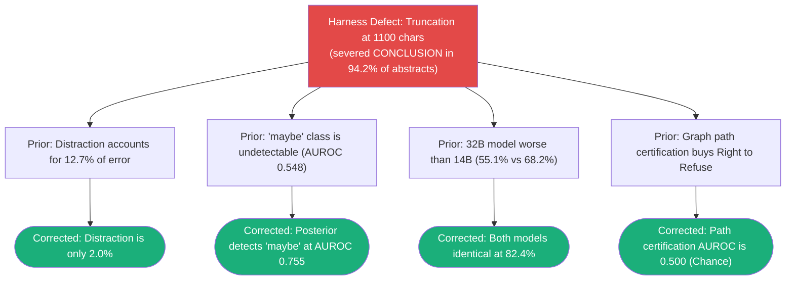

# Research Note: Large-Scale Deterministic Knowledge Graphs (PubMed 2026 Baseline)

> **Type**: Prior-art architecture analysis and adversarial benchmark review — NON-NORMATIVE
> **Source Project**: [`FareedKhan-dev/agentic-knowledge-graph`](https://github.com/FareedKhan-dev/agentic-knowledge-graph) by Fareed Khan (2026)
> **Referenced Dataset**: Full PubMed 2026 baseline (1,334 XML files, 28.3M abstracts, 929.8M edges), PubMedQA benchmark.
> **Date**: 2026-09-08
> **Informs**: `specs/RETRIEVAL.md` (§9.6 Two-Stage Refusal, §9.7 Constrained Decoding, RET-006–RET-009), `specs/GRAPH-INTELLIGENCE.md` (§11.1 CSR Projections), `specs/INGEST-ADAPTERS.md` (§3.8 Streaming XML Invariance, ADA-008), `plans/96-OPT-IN-PUBMED-BENCHMARK.md`.

---

## 1. Executive Summary

Fareed Khan's `agentic-knowledge-graph` constructs a citation and ontology knowledge graph across the entirety of PubMed (28.3 million embedded abstracts, **929,824,202 edges**) with **zero LLM extraction calls**, contrasting with an estimated $33,000 in API costs for comparable LLM-extracted graphs on a single dataset.

Achieving **83.2% accuracy** on 600 held-out PubMedQA questions, the project is notable for its **adversarial self-scrutiny**: several published claims (including its founding governance thesis) were systematically tested, broken, and overturned through empirical measurement.

The findings establish two crucial principles for enterprise knowledge systems:
1. **Topological Admissibility $\neq$ Propositional Truth:** Graph path certification between concepts predicts question veracity at pure chance ($\text{AUROC} \approx 0.500$), whereas raw model confidence ($\max P(y)$ via constrained decoding) achieves $\text{AUROC} \approx 0.810$.
2. **The Truncation Trap:** A single unexamined harness constant (truncating retrieved abstracts to 1,100 characters) severed the trailing `CONCLUSIONS` sections of 94.2% of documents, depressing accuracy by 14.5 percentage points and manufacturing false empirical hypotheses.

---

## 2. Architecture & Implementation Innovations

### 2.1 Zero-LLM Graph Construction from Published Metadata
Instead of utilizing generative models to extract open-vocabulary entities and predicates:
- The graph is synthesized deterministically from authoritative metadata published by the National Library of Medicine (NLM):
  - Inbound and outbound citations (`CITES`, `CITED_BY` from `<ReferenceList>`).
  - Human-curated Medical Subject Headings (`MESH_DESCRIPTOR`, tree numbers, qualifiers).
  - Retractions and errata (`<CommentsCorrectionsList>`).
- Build time: 10.8 minutes across 1,334 XML files into a Parquet columnar store.

### 2.2 Compressed Sparse Row (CSR) in RAM
Rather than deploying external graph databases (Neo4j, Memgraph) whose query-planner round trips incur 1–5 ms statement latency:
- Adjacency matrices are stored as **Compressed Sparse Row (CSR)** binary slices (`indptr.npy`, `indices.npy`) directly in memory.
- Neighborhood expansion is reduced to an instantaneous slice (`indptr[i]:indptr[i+1]`), executing BFS expansion in under $10\ \mu\text{s}$ per node.

### 2.3 Constrained Decoding over Softmax Logits
Rather than allowing free-form text generation parsed via regular expressions (e.g. `\b(yes|no|maybe)\b`, which misreads hedged sentences like *"there is no definitive evidence that..."* as negative assertions):
- Generator (`Qwen2.5-14B-Instruct`) executes a single forward pass with `logits_to_keep=1`.
- Logits are extracted exclusively for the 6 candidate token IDs (`yes`, `no`, `maybe` in lower and title case) and renormalized to produce a complete mathematical posterior distribution $P(y)$.

---

## 3. Adversarial Science: Four Overturned Conclusions

The study documents four instances where empirical measurement debunked flattering prior conclusions:

### 3.1 The 1,100-Character Truncation Trap
- Rank-1 PubMed abstracts average 1,718 characters. Truncating at 1,100 characters removed an average of 628 characters from the end of 94.2% of documents—cutting off the `CONCLUSIONS` paragraph where clinical findings are stated.
- Expanding context from 1,100 to 3,000 characters increased test accuracy from **67.9% to 82.4% (+14.5 points)**.

### 3.2 Refutation of the Distraction & Scale Hypotheses
- With conclusions restored, distraction error dropped from 12.7% to 2.0%.
- Qwen2.5-32B had scored lower (55.1%) because it correctly judged truncated evidence as inconclusive (`maybe`). When scored against intact evidence, 14B and 32B performed identically (82.4%).

### 3.3 Refutation of Graph Certification as a Truth Gate
The project's founding claim was that graph path certification buys the right to refuse:
- Path certification on rank-1 document: **AUROC 0.500 (pure chance)**.
- Path certification across top-8 candidates: **AUROC 0.497**.
- Concept co-annotation overlap: **AUROC 0.519**.
- **Model confidence ($\max P(y)$ via constrained decoding):** **AUROC 0.810**.

Topological reachability establishes topic aboutness, but cannot determine whether an empirical assertion is affirmed or denied.

---

## 4. Synthesis for The Omniscient Trash Heap

1. **Two-Stage Refusal Architecture (`RET-006`, `RET-007`):**
   We have codified this separation into `specs/RETRIEVAL.md`. Stage 1 enforces deterministic structural graph gates (ontology grounding, valid path, non-retracted status). Stage 2 evaluates propositional truth via claim entailment and calibrated confidence $\max P(y)$.
2. **Constrained Logit Decoding (`RET-008`, Plan 97):**
   Applied to promotion review triage (`{"approve", "reject", "revise"}`) and archetype classification, eliminating regex parser vulnerabilities.
3. **High-Scale In-Memory Graph Slices (`specs/GRAPH-INTELLIGENCE.md` §11.1):**
   For large-scale wiki corpora, CSR projections provide sub-millisecond BFS traversals with zero external database daemon dependencies.
4. **Streaming Ingestion Memory Invariance (`ADA-008`, Plan 96):**
   Implemented in `PubmedXmlAdapter` using `iterparse` and sibling clearance to maintain flat RSS memory ($< 250$ MB).
