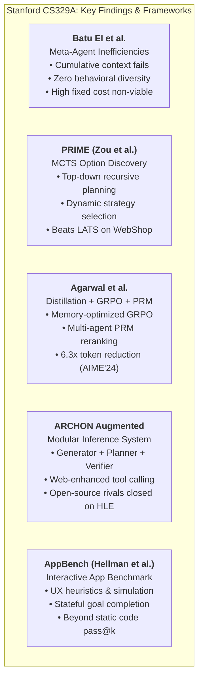

# Research Note P21: Stanford CS329A Project Implementations & LMCache Decentralized KV-Cache Infrastructure

> **Type**: Non-normative graduate project review, inference-time scaling analysis, and KV-cache systems engineering survey  
> **Source Documents**:
>   1. Batu El, Mert Yuksekgonul, James Zou, *Inefficiencies of Meta Agents for Agent Design* (Stanford CS329A Winter 2025 Project Report, 10pp)
>   2. Ethan Hellman, Brendan McLaughlin, Abhinav Lalwani, Belinda Mo, *AppBench: Benchmarking AI-Generated Web Applications* (Stanford CS329A Winter 2025 Project Report, 12pp)
>   3. Chelsea Zou, Samuel Liu, Jui Khankari, *PRIME: Planning with Reflective, Iterative, Multi-agentic Exploration* (Stanford CS329A Winter 2025 Project Report, 7pp)
>   4. Abhinav Agarwal, Carlo Baronio, Shree Reddy, Shubhra Mishra, *Enhancing Mathematical Reasoning in Large Language Models through Reasoning Distillation, GRPO, and Multi-agent PRM Reranking* (Stanford CS329A Winter 2025 Project Report, 10pp)
>   5. Megan Mou, Sherry Xie, Emily Zhang, Andrew Park, *ARCHON Augmented: Planning and Web-Enhanced Components* (Stanford CS329A Winter 2025 Project Report, 11pp)
>   6. Yuhan Liu, Hanchen Li, Yihua Cheng, Siddhant Ray, Yuyang Huang, Qizheng Zhang, Kuntai Du, Jiayi Yao, Shan Lu, Ganesh Ananthanarayanan, Michael Maire, Henry Hoffmann, Ari Holtzman, Junchen Jiang, *CacheGen: KV Cache Compression and Streaming for Fast Large Language Model Serving* (ACM SIGCOMM 2024, DOI: 10.1145/3651890.3672274)
>   7. Junchen Jiang, *LMCache: A Journey* (LMCache Blog, April 17, 2026; `https://blog.lmcache.ai/en/2026/04/17/lmcache-a-journey/`)
>   8. LMCache Core Architecture (`https://lmcache.ai/en/`) & Junchen Jiang Google Scholar Profile (`_8wfjeAAAAAJ`)
> **Retrieved**: 2026-09-08  
> **Informs**: `specs/ARCHITECTURE.md` (Memory hierarchy, plain-text baseline vs tensor caching), `specs/RETRIEVAL.md` (Inference-time search & TTFT latency), `plans/98-TEST-TIME-SEARCH-AND-VERIFIERS.md` (MCTS option discovery, PRM reranking), `specs/VALIDATION.md` (Deterministic verification gates), `specs/INGEST-ADAPTERS.md` (Execution sandboxing).

---

## 1. Executive Summary

This research note bridges two pivotal technical developments of 2025–2026:
1. **Frontier Agent Engineering at Stanford (CS329A Winter 2025 Project Cohort):**  
   Rigorous empirical post-mortems and implementations from Stanford's graduate course on self-improving agents. The papers analyze the fundamental failure modes of meta-agents (Batu El et al.), top-down hierarchical MCTS planning (PRIME), token-efficient reasoning distillation paired with GRPO and multi-agent PRM reranking (Agarwal et al.), modular inference-time architectures (ARCHON Augmented), and interactive application benchmarking (AppBench).
2. **Decentralized KV-Cache Systems Infrastructure (LMCache & CacheGen):**  
   The systems-level breakthrough by Junchen Jiang, Yuhan Liu, and Yihua Cheng (UChicago / Tensormesh / ACM SIGCOMM 2024). LMCache treats LLM Key-Value (KV) caches as a 3D tensor, compressing them by 3.5–4.3x (CacheGen) and offloading them across a multi-tier memory hierarchy (GPU HBM $\to$ Host RAM $\to$ Local NVMe $\to$ Network/Tensormesh). This solves the crippling prefill latency and GPU memory wall of multi-agent and long-context knowledge base querying.

Together, these investigations provide theoretical and systems-level validation for *The Omniscient Trash Heap*'s core architectural posture: **deterministic, structured outer scaffolds dominate unconstrained meta-prompts; and disk-first plain text paired with multi-tier tensor caching bridges durable immutability with low-latency agent reasoning.**

---

## 2. Stanford CS329A Project Deep-Dives



### 2.1 Inefficiencies of Meta-Agents for Agent Design (Batu El, Mert Yuksekgonul, James Zou)
Batu El et al. investigate automated meta-agents (systems where an LLM meta-agent iteratively proposes and refines agent architectures/prompts, following the sample-evaluate-iterate paradigm of Hu et al. 2024):
- **Context Bloat & Meta-Learning Failure:** The prevailing practice of accumulating all prior candidate agent designs into the meta-agent's prompt context actually **degrades performance compared to a baseline that completely ignores prior designs**. The meta-agent does not learn from the history; rather, the bloated context confuses the LLM's attention and induces hallucinated modifications. An evolutionary strategy (keeping only the top Pareto parents) stabilizes cost, but still struggles to discover genuinely novel architectures.
- **Collapse of Behavioral Diversity:** Candidate agents generated across meta-agent iterations exhibit near-zero behavioral diversity. Instead of generating complementary specialist agents (e.g. one specialized in boundary queries, another in synthesis), the meta-agent outputs trivial syntactic variations of the same underlying prompt.
- **Economic Non-Viability:** The fixed token cost of meta-agent search is enormous. The authors show that automated meta-design is economically justifiable **only if deployed over >15,000 test examples** on very specific benchmarks; on standard tasks, human-designed agent scaffolds with deterministic tools consistently achieve higher accuracy at a fraction of the cost.
- **Direct Trash Heap Takeaway:** Validates our architectural axiom **CANON-006** and our fixed, versioned YAML registries (`spec_ownership.yaml`, `object_registry.yaml`). Relying on an autonomous meta-agent to dynamically invent schemas and prompts creates expensive, non-deterministic drift; human-engineered deterministic schemas and compiler linters provide superior reliability and cost efficiency.

### 2.2 PRIME: Planning with Reflective, Iterative, Multi-Agentic Exploration (Chelsea Zou, Samuel Liu, Jui Khankari)
PRIME tackles the unsolved challenge of top-down planning by formalizing multi-step reasoning as an **option discovery problem in reinforcement learning**:
- **Recursive MCTS Decomposition:** Instead of flat sequential generation, PRIME uses Monte Carlo Tree Search to recursively decompose goals into subgoals.
- **Dynamic Strategy Selection:** At each tree node, PRIME dynamically selects between different self-improvement reasoning strategies (reflexion, multi-agent debate, majority voting, or self-feedback) conditioned on task type.
- **LLM Value Function:** An internal value function scores candidate subgoals before execution, pruning dead-end branches early.
- **Results:** Substantially outperforms LATS (Language Agent Tree Search) across WebShop, PlanBench, and Game of 24, showing that structured tree search enables small, compute-limited models to outperform large monolithic models.
- **Direct Trash Heap Takeaway:** Informs [`plans/98-TEST-TIME-SEARCH-AND-VERIFIERS.md`](file:///home/daniel6651/omniscient-trash-heap-spec/plans/98-TEST-TIME-SEARCH-AND-VERIFIERS.md). Demonstrates that recursive tree search over subgoals with intermediate evaluation is the optimal mechanism for complex multi-hop knowledge retrieval and proposal promotion.

### 2.3 Enhancing Mathematical Reasoning via Distillation, GRPO & Multi-Agent PRM Reranking (Abhinav Agarwal, Carlo Baronio, Shree Reddy, Shubhra Mishra)
Agarwal et al. demonstrate that algorithmic discipline beats brute-force model scaling:
- **Distillation:** Transferring reasoning traces from high-capability teacher models (DeepSeek-R1 / QwQ) into 1.5B–32B student models across 387K curated problems.
- **Memory-Optimized GRPO (Zero KL Penalty):** Utilizing Group Relative Policy Optimization, which computes relative rewards within candidate groups, completely eliminating the memory overhead of maintaining a separate critic model.
- **Multi-Agent PRM Reranking:** Sampling multiple solution trajectories, scoring intermediate derivation steps with a Process Reward Model (PRM), and reranking based on step-level correctness.
- **Efficiency Milestone:** Achieves 79.9% on AIME’24 using only **5,048 tokens per problem**—a **6.3x token reduction** compared to the 32K token baseline models.
- **Direct Trash Heap Takeaway:** Strongly validates the Process Reward Model (PRM) verification and Best-of-$N$ reranking specified in Plan 98 and `specs/RETRIEVAL.md` (§9.6).

### 2.4 ARCHON Augmented: Planning and Web-Enhanced Components (Megan Mou, Sherry Xie, Emily Zhang, Andrew Park)
Explores modular inference-time architectures fusing complementary components:
- **Component Topology:** Generator $\to$ Expander $\to$ Planner $\to$ Verifier $\to$ Tool Call (Web Search) $\to$ Ranker.
- **Benchmark:** Evaluated on *Humanity’s Last Exam (HLE)* and AlpacaEval.
- **Key Insight:** Adding a Planner module consistently structures responses more effectively, and a dedicated Tool-Calling module increased AlpacaEval scores above 70%. When augmented with these modular inference-time components, **open-source models rivaled closed-source frontier performance**.
- **Direct Trash Heap Takeaway:** Confirms that modularity (separating generation from planning, verification, and external tool search) is superior to monolithic prompting.

### 2.5 AppBench: Benchmarking AI-Generated Web Applications (Ethan Hellman, Brendan McLaughlin, Abhinav Lalwani, Belinda Mo)
AppBench shifts agent evaluation from static code syntax to interactive usability:
- Traditional code benchmarks (HumanEval, SWE-bench) evaluate unit test pass rates, which fail to capture whether an interactive full-stack app actually works for a human user.
- AppBench introduces interaction simulation, stateful UX heuristics, and end-user goal completion tests in sandboxed browser environments.
- **Direct Trash Heap Takeaway:** Informs `specs/INGEST-ADAPTERS.md` and `specs/INGEST-STAGING.md`. Emphasizes that validating agent actions requires running them in an isolated, sandboxed environment and checking real state mutations rather than static textual assertions.

---

## 3. Systems Infrastructure: LMCache & CacheGen

```mermaid
graph LR
    subgraph "LMCache Multi-Tier Memory Hierarchy"
        GPU["GPU HBM<br/>(Fastest, Smallest)"] <--> |PCIe Transfer| Host["Host DRAM<br/>(High Capacity)"]
        Host <--> |Async I/O| NVMe["Local NVMe SSD<br/>(Multi-TB Storage)"]
        Host <--> |RDMA / TCP (CacheGen)| Remote["Remote KV Cache Pool<br/>(Tensormesh / Cluster)"]
    end
```

### 3.1 The Problem: The GPU Memory Wall in Long-Context Agent Serving
In agentic and knowledge-base systems (such as *The Omniscient Trash Heap*), queries frequently include large context prompts: schema definitions, registry dumps, retrieved note files, and conversation history ($10\text{K}$–$100\text{K}+$ tokens).
- In standard LLM serving (e.g. default vLLM or HuggingFace), every independent query must compute the Key-Value (KV) cache for the entire context prompt during the **prefill phase**.
- This introduces severe latency (high Time to First Token / TTFT) and massive redundant GPU computation.
- Storing all KV caches permanently in GPU High Bandwidth Memory (HBM) is mathematically impossible: a 70B parameter model requires $\approx 1.3\text{MB}$ of KV cache per token per batch. At 100K tokens, a single session consumes $>130\text{GB}$ of GPU RAM purely for the KV cache.

### 3.2 CacheGen: Tensor Compression & Streaming (ACM SIGCOMM 2024)
Junchen Jiang, Yuhan Liu, Yihua Cheng et al. developed **CacheGen**, treating the KV cache not as arbitrary bytes, but as a structured **3D tensor** ($\text{layers} \times \text{heads} \times \text{tokens}$):
1. **Custom Tensor Quantization:** Quantizes key and value tensors dynamically while preserving generation fidelity.
2. **Compact Bitstream Encoding:** Compresses KV tensors by **3.5x–4.3x**.
3. **Adaptive Network Streaming:** Dynamically adjusts compression levels based on network bandwidth, allowing remote KV caches to stream across the cluster faster than GPU local recomputation.
4. **Delay Reduction:** Reduces total context fetching and processing delay by **3.2x–3.7x**.

### 3.3 LMCache & Tensormesh Architecture
In early 2024, the team open-sourced **LMCache** (`lmcache.ai`), expanding CacheGen into a universal, decentralized KV-cache management layer for vLLM and SGLang:
- **Decentralized Multi-Tier Storage:** Automatically cascades KV cache tensors across GPU HBM $\leftrightarrow$ Host DRAM $\leftrightarrow$ Local NVMe $\leftrightarrow$ Remote Redis/Tensormesh.
- **Cross-Instance Sharing:** If Agent 1 (e.g. an ingestion linter) prefills the wiki schema and canonical corpus, Agent 2 (e.g. a retrieval synthesizer running on a different GPU or container) can immediately fetch and reuse the existing KV cache across Host RAM or NVMe, eliminating prefill delay entirely.
- **Production Adoption:** Featured in Jensen Huang’s GTC keynote and supported by major AI infrastructure providers.

---

## 4. Synthesis: Implications for *The Omniscient Trash Heap*

| Technology / Insight | Component | Architectural Impact on Trash Heap |
|---|---|---|
| **Meta-Agent Inefficiencies** (Batu El et al.) | `VALIDATION.md`, `ARCHITECTURE.md` | Proves that dynamic meta-prompt generation suffers from context bloat and mode collapse. Strongly reinforces Trash Heap's deterministic, versioned YAML schema architecture over runtime meta-prompting. |
| **Top-Down MCTS Planning** (PRIME) | `plans/98-TEST-TIME-SEARCH-AND-VERIFIERS.md` | Validates recursive tree search over subgoals with dynamic strategy selection as the optimal model for complex knowledge compilation. |
| **Memory-Optimized GRPO & PRMs** (Agarwal et al.) | `RETRIEVAL.md` §9.6, Plan 98 | Provides an efficient training and inference recipe: Group Relative Policy Optimization eliminates critic overhead, while PRM reranking yields 6.3x token savings. |
| **Modular Inference Architectures** (ARCHON) | `RETRIEVAL.md`, `AGENT-SKILLS.md` | Confirms that separating Generators, Verifiers, Planners, and Tool Searchers enables open models to rival closed frontier models. |
| **Multi-Tier KV Cache Offloading** (LMCache / CacheGen) | `ARCHITECTURE.md` §2.3, Infrastructure | Demonstrates how our plain-text Knowledge Library can be served with near-instant TTFT: Markdown files remain the canonical ground truth on disk (`CANON-002`), while LMCache maintains reusable KV caches in Host RAM/NVMe for multi-agent querying. |

---

## 5. Provenance & Archival Record

The 5 Stanford CS329A project research papers have been retrieved and archived:
- `batu.pdf`: *Inefficiencies of Meta Agents for Agent Design* (Batu El, Mert Yuksekgonul, James Zou)
- `appbench.pdf`: *AppBench: Benchmarking AI-Generated Web Applications* (Ethan Hellman, Brendan McLaughlin, Abhinav Lalwani, Belinda Mo)
- `prime.pdf`: *PRIME: Planning with Reflective, Iterative, Multi-agentic Exploration* (Chelsea Zou, Samuel Liu, Jui Khankari)
- `enhancing.pdf`: *Enhancing Mathematical Reasoning in LLMs...* (Abhinav Agarwal, Carlo Baronio, Shree Reddy, Shubhra Mishra)
- `archon.pdf`: *ARCHON Augmented: Planning and Web-Enhanced Components* (Megan Mou, Sherry Xie, Emily Zhang, Andrew Park)

LMCache & CacheGen citations:
- Yuhan Liu, Junchen Jiang et al., *CacheGen: KV Cache Compression and Streaming for Fast Large Language Model Serving*, ACM SIGCOMM 2024 (DOI: `10.1145/3651890.3672274`).
- Junchen Jiang, *LMCache: A Journey*, LMCache Blog (April 17, 2026).
- LMCache Project: `https://lmcache.ai/en/` (Tensormesh).
