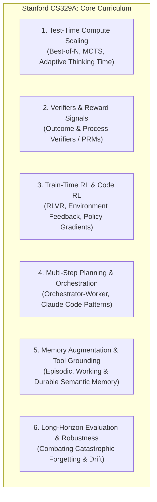
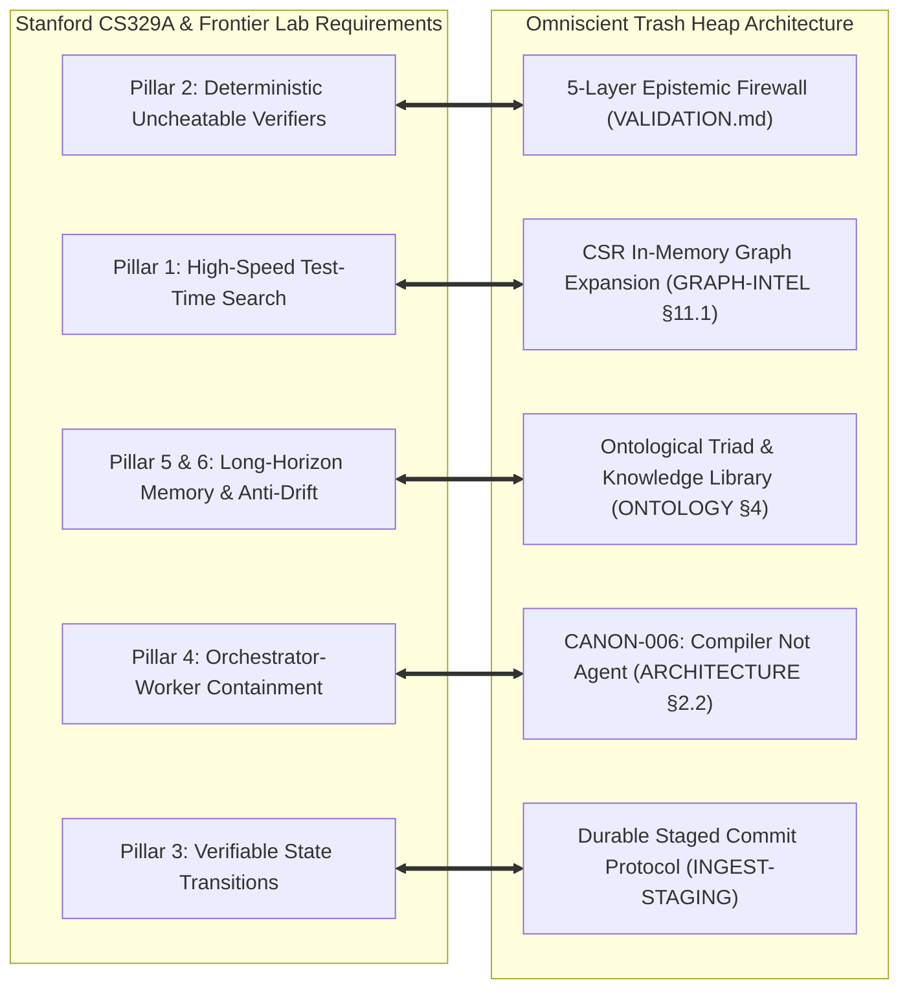

# Research Note: Stanford CS329A (Self-Improving AI Agents) & The Frontier Lab Agent Paradigm

> **Type**: Graduate curriculum review, test-time compute analysis, and frontier lab engineering survey — NON-NORMATIVE
> **Source Article**: *"Stanford Just Put an $850K/Year Skill on YouTube"* by Valerie (August 10, 2026)
> **Referenced Academic Course**: Stanford CS329A / XCS329: *Self-Improving AI Agents* (Fall 2025 / Public August 2026)
> **Instructors**: Aakanksha Chowdhery (PaLM 540B lead, Gemini MoE pre-training) and Azalia Mirhoseini (Stanford Scaling Intelligence Lab, Google Brain, Google DeepMind, Anthropic Claude co-developer).
> **Guest Speakers**: Denny Zhou (Google DeepMind), Thang Luong (Google DeepMind), Misha Laskin (Reflection AI), Danny Driess (Physical Intelligence).
> **Date**: 2026-09-08
> **Informs**: `specs/ARCHITECTURE.md` (CANON-006, Knowledge Library §2.3), `specs/VALIDATION.md` (5-Layer Uncheatable Verifiers), `specs/RETRIEVAL.md` (Test-Time Graph Search & Calibrated Refusal), `specs/ONTOLOGY.md` (§4 Ontological Triad & Cognitive Erosion Defenses), `specs/INGEST-STAGING.md` (DSCP Transaction Durability).

---

## 1. Executive Summary

In August 2026, Stanford University publicly released the complete lecture series and curriculum for **CS329A: Self-Improving AI Agents**. Taught by frontier researchers from Google DeepMind and Anthropic, the course codifies the structural pivot currently reshaping the AI industry:
> **The primary frontier scaling vector has transitioned from pre-training base model parameters ($N_{\text{params}}$) to test-time compute scaling, agentic search, external verification, and durable reinforcement learning loops ($T_{\text{inference}} \times V_{\text{verifier}}$).**

This pivot explains the market valuation of agent harness engineers (commanding $500,000–$850,000 base salaries at Anthropic for *Research Engineer, Agents* and *Code RL* roles). Frontier labs have converged on the realization that scaling models without **uncheatable verifiers** and **durable memory architectures** produces brittle agents that catastrophically decay on long-horizon tasks.

This research note examines the six core pillars of CS329A and maps them directly to the architectural invariants of *The Omniscient Trash Heap*.

---

## 2. The Six Technical Pillars of CS329A

### 2.1 Pillar 1: Test-Time Compute Scaling
Rather than relying on single-pass greedy decoding ($T=1$), models achieve frontier performance by allocating compute dynamically at inference time:
- **Search over Thought Trajectories:** Executing Monte Carlo Tree Search (MCTS), beam search, or Best-of-$N$ candidate sampling.
- **System 2 Deliberation:** Expanding tokens on intermediate reasoning steps before committing to irreversible environment mutations.

### 2.2 Pillar 2: Verifiers & Process Reward Signals
The critical bottleneck in self-improvement is **the reward signal**:
- **The Self-Evaluation Trap:** Asking an LLM to evaluate its own output in a circular prompt induces shared hallucinations and reward hacking.
- **Uncheatable Verifiers:** Reliable self-improvement requires external, deterministic, non-neural verifiers: compilers, unit tests, linters, schema validators, and formal proof checkers.
- **Process Reward Models (PRMs):** Rewarding intermediate reasoning milestones rather than evaluating solely on terminal outcomes.

### 2.3 Pillar 3: Train-Time RL & Code RL
- Training language models directly within execution environments where code is written, executed, tested, and debugged in a closed feedback loop.
- **Reinforcement Learning with Verifiable Rewards (RLVR):** Leveraging deterministic ground truth (e.g., test suite pass/fail) as an ungameable policy reward.

### 2.4 Pillar 4: Multi-Step Reasoning & Orchestrator-Worker Topologies
- Deconstructing monolithic agents into specialized functional roles (as demonstrated in the Claude Code case study):
  - High-level orchestrators managing task trees and invariant enforcement.
  - Ephemeral worker subagents performing bounded code modifications or targeted research.

### 2.5 Pillar 5: Memory Augmentation & Tool Grounding
- Overcoming context window boundaries through hierarchical memory tiers:
  - Working memory (scratchpads, transient tool outputs).
  - Episodic memory (historical trajectory logs).
  - Semantic/Canonical memory (curated architectural knowledge, invariant rules).

### 2.6 Pillar 6: Long-Horizon Task Degradation
The central failure mode of contemporary agents:
- As task horizons expand from 5 steps to 50+ steps, standard agents suffer from **context window pollution**, **cognitive drift**, and **hallucination propagation**.
- Without transactional checkpointing and clean pruning, agents enter repetitive error loops and exhaust their context budgets.

---

## 3. Direct Architectural Mapping to *The Omniscient Trash Heap*

The curriculum of CS329A and the engineering requirements of Anthropic's Code RL roles provide conclusive academic validation for *The Omniscient Trash Heap*'s over-engineered architecture:

### 3.1 Uncheatable Verifiers (Pillar 2 $\leftrightarrow$ `VALIDATION.md`)
CS329A emphasizes that agent self-improvement collapses into cognitive decay without uncheatable verifiers. 
Our **5-Layer Epistemic Validation Pipeline** ([`specs/VALIDATION.md`](specs/VALIDATION.md)) implements this exact construct:
- Layer 1: Structural syntax verification (YAML/CommonMark).
- Layer 2: Frontmatter schema verification (`object_registry.yaml`).
- Layer 3: Ontological consistency and cycle prevention (`REL-004a`).
- Layer 4: Shannon entropy secret filtering and prompt injection fencing.
- Layer 5: Referential integrity and AST hash pinning ([`SG-013`](specs/STRUCTURAL-GRAPH.md)).

No LLM is permitted to self-certify its own additions; deterministic Python linters serve as the external, ungameable verifier.

### 3.2 High-Speed Test-Time Graph Search (Pillar 1 $\leftrightarrow$ `GRAPH-INTELLIGENCE.md`)
Scaling test-time search requires exploring relational neighborhoods without incurring prohibitive API token costs or graph database network latency.
- Our **Compressed Sparse Row (CSR)** in-memory graph representation ([`specs/GRAPH-INTELLIGENCE.md`](specs/GRAPH-INTELLIGENCE.md) §11.1, [`trashheap/graph/csr.py`](../trashheap/graph/csr.py)) allows agents to perform bounded BFS traversals in **$<10\ \mu\text{s}$ per node**.
- Agents deliberate over the topological structure of knowledge at hardware speed before selecting which documents to load into context.

### 3.3 Combating Cognitive Erosion & Long-Horizon Decay (Pillars 5 & 6 $\leftrightarrow$ `ONTOLOGY.md`)
CS329A's warning that agents "quietly fall apart on long-horizon tasks" directly matches our critique of unstructured memory accumulation (`research/critiques-and-community-feedback.md` S5).
- *The Omniscient Trash Heap* solves this via the **Ontological Triad** ([`specs/ONTOLOGY.md`](specs/ONTOLOGY.md) §4):
  $$\text{Observation / Trace} \xrightarrow{\text{Compaction}} \text{Generalized Lesson} \xrightarrow{\text{Formalization}} \text{Executable Workflow / Skill}$$
- Instead of appending endless execution transcripts to an uncurated log, raw agent traces are compiled into discrete, versioned, typed knowledge artifacts.

### 3.4 Transactional Durability & Agent Harnesses (Pillars 3 & 4 $\leftrightarrow$ `INGEST-STAGING.md`)
Anthropic's emphasis on building industrial agent harnesses capable of shipping real code is reflected in our **Continuous Staged Commit Coordinator (CSCC)** and **Durable Staged Commit Protocol (DSCP)** ([`specs/INGEST-STAGING.md`](specs/INGEST-STAGING.md)):
- Atomic multi-phase commits (`STAGED` $\rightarrow$ `LINTED` $\rightarrow$ `COMMITTED`).
- Write-Ahead Logging (WAL) and rollback journals.
- Checkpointed state persistence, ensuring that worker agent crashes never corrupt the underlying knowledge repository.

---

## 4. Synthesis: The Industrial Validation of "Over Engineering"

The revelation that Stanford graduate education and Anthropic frontier engineering are focused entirely on **verifiers, test-time compute, deterministic harnesses, and structured memory compilation** proves that our architecture is correctly targeted:

1. **Prompt engineering is a solved commodity.** The high-value frontier ($850K skill) lies in building the **deterministic control planes and verification harnesses** that govern stochastic models.
2. **"Over Engineering" is the required standard for production.** A system lacking formal registries, schema validation, CSR projections, and transaction rollback guarantees is not "lean"—it is an uncalibrated toy that will degrade on step 10 of a 50-step task.
3. **The Compiler Paradigm (`CANON-006`) is the Endgame.** As taught in CS329A, agents do not achieve reliability by being granted unchecked root access to systems; they achieve reliability by proposing structured mutations to a deterministic compiler that evaluates them against invariant ground truth.
