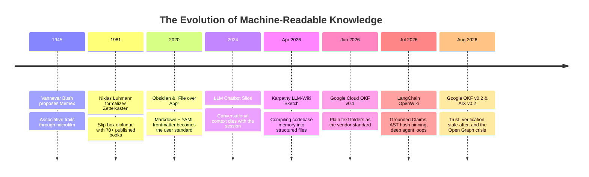
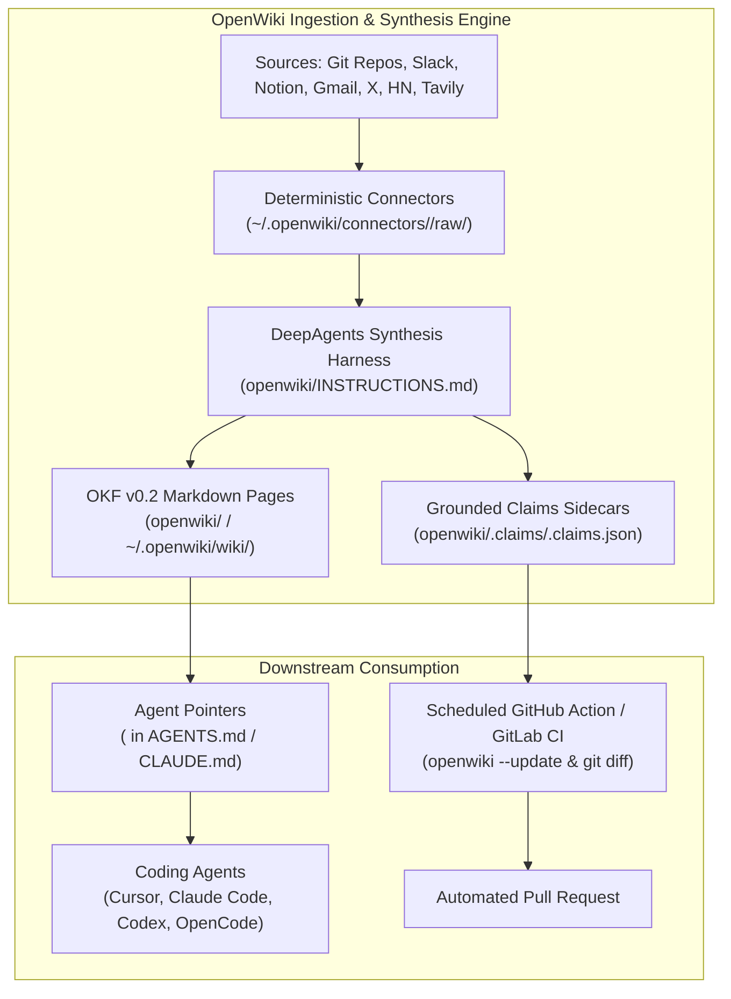

# Research Note: The State of the Nation in LLM Knowledge Bases (2026) & The OpenWiki Paradigm

> **Type**: Industry state-of-the-nation survey, standard convergence review, and framework analysis — NON-NORMATIVE
> **Source Documents**:
> - *"The State of the Nation in LLM Knowledge Bases in 2026"* by David R Oliver (August 21, 2026)
> - *"Introducing OpenWiki, an open source agent for repo documentation"* (LangChain Official Announcement, July 2026)
> - OpenWiki Official Documentation & Architecture (`docs.langchain.com/oss/openwiki/overview`)
> - OpenWiki Open-Source Repository (`github.com/langchain-ai/openwiki`)
> - AIX v0.2 Specification (David R Oliver)
> **Date**: 2026-09-08
> **Informs**: `specs/ARCHITECTURE.md` (CANON-006, Knowledge Library Paradigm §2.3), `specs/OKF-INTEROP.md` (OKF-001–OKF-010), `specs/STRUCTURAL-GRAPH.md` (SG-013 Grounded Claims & AST Hash Pinning), `specs/GRAPH-INTELLIGENCE.md` (§11 CSR Open Graph), `specs/ONTOLOGY.md` (§4 Typed Relations), `plans/61-KNOWLEDGE-BUNDLES-OKF-EXCHANGE.md`.

---

## 1. Executive Summary

In August 2026, the artificial intelligence and knowledge management sectors converged on a shared consensus: **the foundational container for machine-readable knowledge is not a proprietary vector database or closed cloud API, but a version-controlled folder of plain text files (Markdown with frontmatter)**.

This convergence resolves what David R Oliver terms the **1981 Filing Trick**—adapting Niklas Luhmann's *Zettelkasten* (slip-box) and Vannevar Bush's 1945 *Memex* into an automated cognitive pipeline where **the next reader is an AI agent**.

However, as personal note folders scale to team repositories (thousands of documents), plain text hits an inevitable **"folder ceiling"** where raw file reading exhausts agent context budgets. The industry has fragmented into three battlegrounds:
1. **The Reading Room (Index Layer):** Fast local SQLite full-text search indexes vs. zero-dependency raw file re-reading (`okflib`).
2. **The Open Graph Crisis:** Google Cloud's `kcmd` tool syncs open OKF folders into the proprietary *Google Cloud Knowledge Catalogue*, creating a monetization tollbooth at the graph layer. The open-source ecosystem desperately requires an **open, local-first graph engine**.
3. **The Library Model & Multimodal Identity:** Moving from single-folder silos to federated cross-team libraries with permanent namespace identifiers, typed semantic edges, and cryptographic content hashes for multimodal assets.

Concurrently, LangChain's release of **OpenWiki** (`langchain-ai/openwiki`) operationalizes this paradigm into a production-grade CLI and GitHub Action, bridging codebase documentation, dual-persisted **Grounded Claims**, Google OKF v0.2 export, and coding-agent bootstrap pointers (`AGENTS.md` / `CLAUDE.md`).

---

## 2. Historical Genealogy: From Luhmann & Bush to Cognitive Compilers



Oliver identifies three core primitives that underpin the entire movement:
- **Markdown:** Human- and machine-readable text with minimal structural syntax (`#`, `*`) that will remain readable across century timescales.
- **Frontmatter:** Machine-actionable structured key-value pairs (YAML/JSON) at the head of the file. Prose below is for human/agent comprehension; metadata above is for sorting, indexing, and governance.
- **Agent:** An autonomous LLM model equipped with tools to read, follow references, search, and mutate state.

### 2.1 The Team Failure Mode: Structure, Not Will
Personal vaults succeed because the **writer, reader, and curator are the same person**. Team wikis fail ("one page from 2017 written with love, 30 abandoned stubs, unfindable search results") because:
- Most pages are written by individuals who will never revisit them.
- Readers cannot assess whether historical pages remain trustworthy.
- Human discipline cannot scale across hundreds of developers.

### 2.2 The Compiler Solution: "Pages are Authorship; Bundles are Use"
The discipline must transition from human habits to an **automated build pipeline (Knowledge Compiler)**:
> *"The discipline has to move: not to a better app, but to a pipeline, an automated build step. It takes the folder and compiles it into what each reader needs. A page is what an author produces. A reader needs more: the design, the decisions behind it, the parts it depends on, the right people. All assembled into one named package. Call that package a bundle."*

Furthermore, **knowledge shapes must be preserved**: squashing tabular structures or chopping long legal/architectural contracts into arbitrary 500-token chunks irreversibly leaks relational context.

---

## 3. The Format Wars: Settled, Contested, and Unclaimed

### 3.1 Settled: Plain Text Won Three Times
The debate over raw storage format is definitively over:
1. **Users:** The Obsidian / PKM community established *"file over app"*; local plain text files outlive proprietary software platforms.
2. **Vendors:** Google Cloud standardized on **OKF** (Open Knowledge Format). The Linux Foundation adopted **`AGENTS.md`** across >60,000 repositories.
3. **Theorists:** Semantic Web researchers (Kurt Cagle, W3C Holon Group) abandoned complex OWL/RDF database silos to build directly on top of OKF Markdown folders.

### 3.2 Contested: The Reading Room (Index Layer)
When a vault exceeds several hundred files, feeding the entire folder into an LLM context window exhausts its attention budget:
- **Approach A (SQLite FTS):** Compiling the folder into a local SQLite database with full-text search (BM25/relevance ranking). Rebuilt in seconds on change; agent queries via tools; human queries directly.
- **Approach B (Zero-DB Streaming / `okflib`):** Scanning raw files on every query. Eliminates cache invalidation and database drift, but encounters linear $O(N)$ latency scaling in the low thousands of documents.

### 3.3 Resolved: The Proprietary Graph Tollbooth
Oliver uncovered why Google's initial OKF specification declared databases "out of scope":
- Located in the official OKF repository is `kcmd` ("git for metadata").
- `kcmd` synchronizes local OKF folders with **Google Cloud Knowledge Catalogue**—Google's paid, closed-source knowledge graph for enterprise agents.
- **The Critical Hazard:** If the only graph layer that exists sits behind a cloud meter, local-first open portability dies at the first step. **The open-source world urgently requires an open, local graph engine.**

### 3.4 Unclaimed Territory: The Three Dragons
1. **Cross-Team Federation (The Library Model):** Resolving entity collisions (e.g., Team A and Team B both defining `customers`), establishing cross-bundle citation syntax (`team-name/note-name`), and defining trust propagation.
2. **Multimodal Asset Identity:** Moving beyond naked HTTP URLs for diagrams and recordings by assigning cryptographic SHA-256 byte hashes and embedding pointers directly in frontmatter.
3. **Open-Source Knowledge Graphs:** High-performance, embedded graph engines that run entirely on local compute without cloud subscriptions.

---

## 4. LangChain OpenWiki Architecture & Capabilities

LangChain's official OpenWiki release (`langchain-ai/openwiki`, July–August 2026) provides an industrial implementation of the LLM-Wiki compiler paradigm.



### 4.1 Dual Operating Modes
1. **Code Mode (`openwiki` / `openwiki code`):**
   - Targets repository architectural context.
   - Synthesizes documentation under `openwiki/`.
   - Ingests runtime telemetry via the **LangSmith connector** (extracting tool calls, latency, error rates) so docs reflect actual runtime execution, not just static code comments.
2. **Personal Mode (`openwiki personal`):**
   - Targets personal cross-source synthesis under `~/.openwiki/wiki/`.
   - Ingests heterogeneous streams via dedicated connectors: Git repos, Slack, Notion MCP, Gmail, X/Twitter OAuth, Tavily Web Search, Hacker News.

### 4.2 Grounded Claims Specification
OpenWiki guarantees factual reliability through versioned claim sidecars (`openwiki/.claims/<page>.claims.json`):
- Factual claims are bound to line intervals and content hashes (`sha256(source[start:end])`).
- On scheduled updates (`openwiki --update`), Git diffs evaluate modified lines against claim hashes.
- Mismatched claims force targeted page regeneration without requiring full repository rescans.
- Pages earn `verified: {by: openwiki/<version>, at: <timestamp>}` frontmatter only after passing preflight evidence rechecks and persisting claim sidecars.

### 4.3 Agent Bootstrap Blocks
OpenWiki injects an isolated delimiter block into repository root instruction files:
```markdown
<!-- OPENWIKI:START -->
## Codebase Knowledge Map
The documentation for this repository is maintained in `openwiki/`.
Consult `openwiki/index.md` for architectural overview, key component dependencies,
and runtime execution traces before inspecting raw source trees.
<!-- OPENWIKI:END -->
```
This bounds agent context consumption, saving 10–100× tokens on session startup while leaving the remainder of `AGENTS.md` and `CLAUDE.md` untouched.

### 4.4 Automated Self-Healing Mermaid Diagrams
- OpenWiki generates Mermaid sequence, ER, state, and flow diagrams grounded in source code.
- Post-run linters validate all `mermaid` blocks.
- If diagram syntax fails, it is automatically converted into a `text` block with a diagnostic comment, preventing UI rendering crashes and signaling self-healing on the next `--update` run.

---

## 5. Architectural Convergence: Mapping to *The Omniscient Trash Heap*

The findings across Oliver's survey and LangChain's OpenWiki represent an overwhelming external validation of the architectural choices made in *The Omniscient Trash Heap*.

| Dimension | Industry State (Oliver / OpenWiki 2026) | Omniscient Trash Heap Specification | Status & Reference |
|---|---|---|---|
| **Core Paradigm** | "Compiler, Not Agent"; automated build step over folders | **CANON-006**: LLM only reasons, never touches filesystem directly | `ARCHITECTURE.md` §2.2 |
| **Unit of Consumption** | Bundles as unit of use; pages as unit of authorship | **Knowledge Bundles**: Multi-page scoped bundles with manifests | `specs/OKF-INTEROP.md`, Plan 61 |
| **Federated Library** | Cross-bundle citations (`team/note`); shared vocabularies | **Knowledge Library Paradigm**: Multi-corpus manifests & federated scopes | `ARCHITECTURE.md` §2.3, `CORPUS_MANIFEST.yaml` |
| **Factual Grounding** | Grounded Claims sidecars pinning line ranges and SHA-256 hashes | **AST Hash Pinning**: Cryptographic code-claim binding in Structural Graph | `specs/STRUCTURAL-GRAPH.md` (SG-013) |
| **The Open Graph Answer** | Proprietary Google Cloud Knowledge Catalogue vs. No Open Graph | **CSR In-Memory Projections**: Sub-10$\mu$s BFS expansion in RAM | `specs/GRAPH-INTELLIGENCE.md` §11.1, `trashheap/graph/csr.py` |
| **Index Layer** | SQLite FTS vs. raw `okflib` file re-scanning | **Two-Stage SQLite + CSR Engine**: Hybrid BM25/Vector/Graph traversal | `specs/RETRIEVAL.md`, `trashheap/retrieval.py` |
| **Epistemic Trust** | OKF v0.2 `sources`, `verified`, `stale_after` | **5-Layer Epistemic Pipeline**: Multi-dimensional verification & decay | `specs/VALIDATION.md`, `specs/EPISTEMOLOGY.md` |
| **Multimodal Assets** | AIX v0.2 byte hashes and embedding slots | **Multimodal Artifact Registry**: Invariant SHA-256 tracking & Parquet digests | `specs/SCHEMA.md`, `specs/INGEST-ADAPTERS.md` |
| **Transaction Durability** | OpenWiki Ralph Loop (.run.json monotonic progress) | **CSCC & DSCP**: Continuous Staged Commit Coordinator & durable journal | `specs/INGEST-STAGING.md` |

---

## 6. Synthesis & Strategic Conclusions

1. **The Open Graph is Our Natural Stronghold:** Google has retreated to monetizing enterprise knowledge graphs via `kcmd` and Google Cloud Knowledge Catalogue. *The Omniscient Trash Heap*'s high-performance, embedded, open-source Compressed Sparse Row (CSR) graph engine (`trashheap/graph/csr.py`) directly occupies the critical territory left open by proprietary vendors.
2. **Grounded Claims & AST Pinning are Load-Bearing:** OpenWiki proves that documentation decays unless anchored cryptographically to AST elements. Our `SG-013` invariant must remain an unbreakable contract.
3. **The 1981 Filing Trick is the Future:** By maintaining plain text files governed by deterministic compilers, we ensure that enterprise memory outlives proprietary platforms, token formats, and transient agent architectures.
